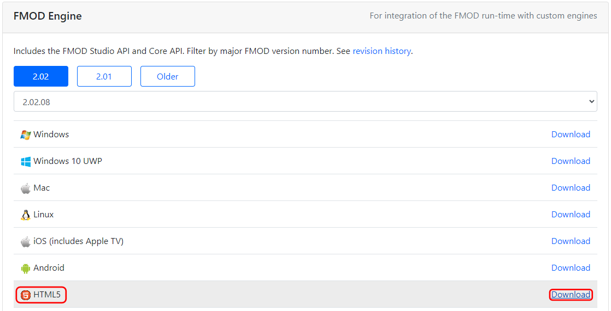
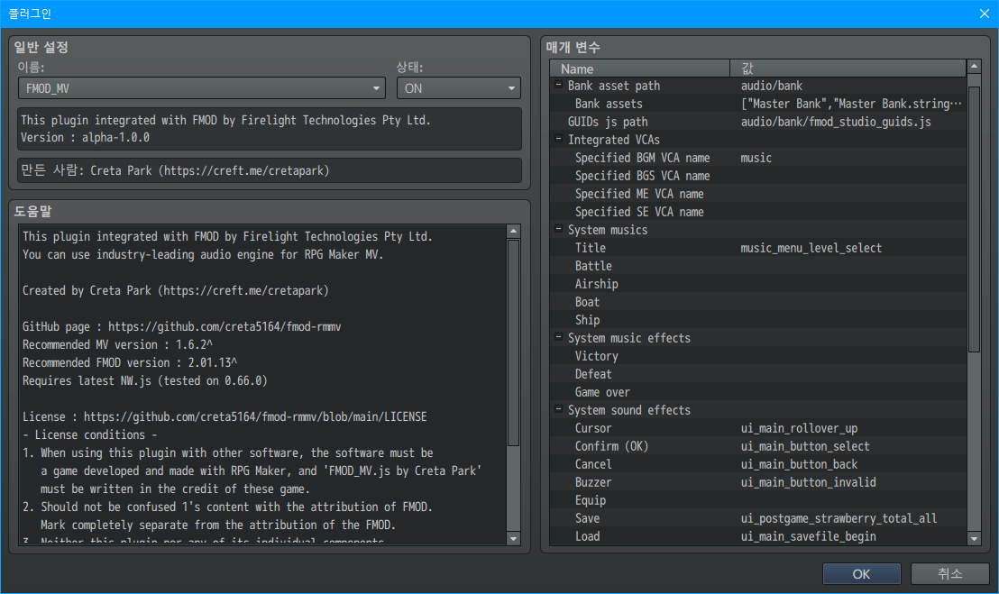
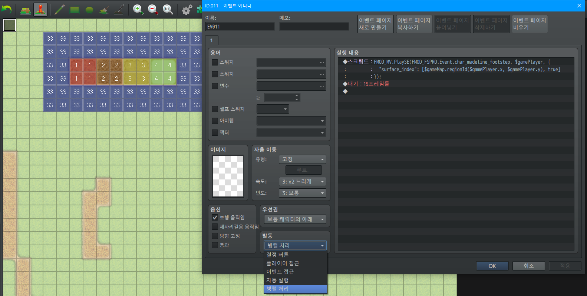

# FMOD_MV.js

<p align="center">
  
</p>

이 플러그인은 Firelight Technologies Pty Ltd의 FMOD를 적용합니다.  
게임 업계 최고의 오디오 엔진을 RPG 만들기 MV에 사용해 보세요.

제작 : Creta Park (https://creft.me/cretapark)

이 플러그인의 라이선스는 MIT 라이선스의 변형을 사용하므로,
아래의 라이센스 허가 조건을 준수하는 한 자유롭게 사용할 수 있습니다.

1. 이 플러그인을 다른 소프트웨어와 함께 사용하는 경우,
   소프트웨어는 RPG 만들기로 개발 및 제작 된 게임이어야 하며,
   게임의 크레딧에는 `FMOD_MV.js by Creta Park`가 반드시 들어가야 합니다.

2. 1의 내용을 FMOD의 저작자 표기와 혼동해서는 안 됩니다.  
   FMOD의 저작자 표기와 완전히 별개로 표기하세요.

3. 이 플러그인의 원본 또는 수정된 버전이나
   개별 구성 요소는 단독으로 판매될 수 없습니다.

4. 수정 후 재배포를 하는 경우, 원저작자를 반드시 표기해야 합니다.

*이 내용은 [LICENSE][LICENSE] 파일에서도 찾을 수 있습니다.*

---

## FMOD가 뭔가요?

FMOD는 소리를 처리하고 관리하는 오디오 미들웨어(Middleware)입니다.  
주로 비디오 게임에 사용되며 적응형 오디오를 사용하는 데 도움이 됩니다.

자세한 내용은 아래에 Scruffy님이 요약한 동영상을 확인하세요.

<p align="center">
  <a href="https://youtu.be/p-FLWabby4Y">
    
  </a>
</p>

## 만들게 된 배경

이 플러그인은 [1맵 1치킨 알만툴 대회][1map-twitter]에서 주최하는 게임잼 이벤트인
[2022 1치킨 게임잼][1map]을 위해 만들었습니다.

이번 게임잼에 참여해서 만든 게임은 DOWNFALLEN(다운폴른)이었고,
이 게임에 맞는 플러그인을 만들 수 있는 기회가 만들어졌기 때문입니다.

[여기에서 플레이 할 수 있습니다][DOWNFALLEN].

## 데모

어떤 기능을 하는 지 궁금하시다면 이 영상을 확인하세요.

<p align="center">
  <a href="https://youtu.be/YcVaRldGb4c">
    
  </a>
</p>

## 목차

- 1\. [기본적인 지식 요구사항](#1-기본적인-지식-요구사항)
- 2\. [플러그인의 한계](#2-플러그인의-한계)
- 3\. [프로젝트 준비 작업](#3-프로젝트-준비-작업)
  * 3.1. [플러그인 추가하기](#31-플러그인-추가하기)
  * 3.2. [FMOD 엔진 추가하기](#32-fmod-엔진-추가하기)
- 4\. [예제 빨리 확인하기](#4-예제-빨리-확인하기)
- 5\. [플러그인 설정](#5-플러그인-설정)
  * 5.1. [최대 메모리](#51-최대-메모리)
  * 5.2. [뱅크 파일 경로](#52-뱅크-파일-경로)
  * 5.3. [사용할 뱅크 파일들](#53-사용할-뱅크-파일들)
  * 5.4. [GUID 스크립트 경로](#54-guid-스크립트-경로)
  * 5.5. [연동할 VCA들](#55-연동할-vca들)
  * 5.6. [시스템 음악(BGM)들](#56-시스템-음악bgm들)
  * 5.7. [시스템 음악 효과음(ME)들](#57-시스템-음악-효과음me들)
  * 5.8. [시스템 효과음(SE)들](#58-시스템-효과음se들)
- 6\. [사용법](#6-사용법)
  * 6.1. [FMOD_MV.js에서 이벤트가 동작하는 방식](#61-fmod_mvjs에서-이벤트가-동작하는-방식)
  * 6.2. [이벤트 재생하기](#62-이벤트-재생하기)
    + 6.2.1. [BGM 재생](#631-bgm-재생)
    + 6.2.2. [BGS 재생](#622-bgs-재생)
    + 6.2.3. [ME 재생](#623-me-재생)
    + 6.2.4. [SE 재생](#624-se-재생)
  * 6.3. [이벤트 제어하기](#63-이벤트-제어하기)
    + 6.3.1. [BGM 정지](#631-bgm-정지)
    + 6.3.2. [BGM 파라미터 지정](#632-bgm-파라미터-지정)
    + 6.3.3. [BGM 카테고리의 이벤트가 재생 중인지 확인](#633-bgm-카테고리의-이벤트가-재생-중인지-확인)
    + 6.3.4. [BGS 정지](#634-bgs-정지)
    + 6.3.5. [BGS 파라미터 지정](#635-bgs-파라미터-지정)
    + 6.3.6. [BGS 카테고리의 이벤트가 재생 중인지 확인](#636-bgs-카테고리의-이벤트가-재생-중인지-확인)
    + 6.3.7. [ME 정지](#637-me-정지)
    + 6.3.8. [ME 파라미터 지정](#638-me-파라미터-지정)
    + 6.3.9. [ME 카테고리의 이벤트가 재생 중인지 확인](#639-me-카테고리의-이벤트가-재생-중인지-확인)
    + 6.3.10. [SE 정지](#6310-se-정지)
  * 6.4. [스피커](#64-스피커)
    + 6.4.1. [대상 스피커의 이벤트 정지](#641-대상-스피커의-이벤트-정지)
    + 6.4.2. [대상 스피커의 이벤트 파라미터 지정](#642-대상-스피커의-이벤트-파라미터-지정)
    + 6.4.3. [대상 스피커가 기억하는 특정 이벤트의 파라미터 설정 지우기](#643-대상-스피커가-기억하는-특정-이벤트의-파라미터-설정-지우기)
    + 6.4.4. [대상 스피커가 기억하는 모든 이벤트의 파라미터 설정 지우기](#644-대상-스피커가-기억하는-모든-이벤트의-파라미터-설정-지우기)
    + 6.4.5. [GUID에 해당하는 이벤트가 바인딩 됐는지 확인](#645-GUID에-해당하는-이벤트가-바인딩-됐는지-확인)
  * 6.5. [스냅샷 제어하기](#65-스냅샷-제어하기)
    + 6.5.1. [스냅샷 시작](#651-스냅샷-시작)
    + 6.5.2. [스냅샷 중단](#652-스냅샷-중단)

# [1.][toc] 기본적인 지식 요구사항

- FMOD 스튜디오 사용법을 잘 알고 있어야 합니다.

- FMOD의 [라이센스][fmod-license], [저작자 표기][fmod-attribution]
  그리고 [법적 정보][fmod-legal]에 대해 잘 알고 있어야 합니다.


# [2.][toc] 플러그인의 한계

이 플러그인은 거의 일주일이라는 짧은 기간에 만들어졌기 때문에,
이 플러그인을 사용한 게임인 DOWNFALLEN에 포함되지 않은 일부
RPG 만들기의 기능이나 FMOD의 일부 기능이 현재 누락된 상태입니다.  
제가 이 플러그인을 알파 단계로 출시한 이유죠.

풀 리퀘스트나 기여는 언제나 환영입니다!

현재 제가 확인한 한계는 다음과 같습니다.

- 도플러 효과 등의 속도  
  RPG Maker의 캐릭터는 이동 속도가 매우 일정하기 때문에,
  속도를 적용했을 때 결과가 너무 이상해서 구현하지 않았습니다.

- RPG Maker의 기본 오디오 시스템을 FMOD로 스트리밍  
  FMOD는 외부 오디오 버퍼를 읽어서 버스를 통해
  출력하는 기능이 있지만 아직 구현되지 않았습니다.

- RPG Maker 리소스의 FMOD 이벤트 인스턴스 생성  
  FMOD는 오디오 파일에서 이벤트 인스턴스를 생성할 수도 있습니다.  
  하지만 RPG Maker의 암복호화 파이프라인을   어떻게 해결하고 구현할 지는 아직 정해지지 않았습니다.

- 청취자(Listener) 위치와 다른 카메라 플러그인 호환성 확인 안 됨  
  카메라를 확대, 축소 또는 제어하는 다른 카메라 플러그인이 있는 경우,
  입체 사운드가 제대로 들리지 않을 수 있습니다.  
  직접 호환되게 만드려고 하는 경우, `FMOD_MV.js`에서
  `Game_Map.prototype.updateListenerAttributes`를 찾으세요.  
  여기에는 청취자의 위치를 ​​업데이트하는 코드가 포함되어 있습니다.

- 이벤트 콜백을 지원할 수 없습니다.  
  이벤트 콜백은 FMOD 스튜디오에서 생성한 이벤트에 호출 함수를 넣으면
  게임에서 이 신호를 받는 기능입니다.  
  기본적으로 박자 당 호출 등과 같은 기능을 제공합니다.
  
  이 문제는 제 플러그인 설계의 큰 실수입니다.
  
  콜백은 FMOD의 이벤트에 대해 등록할 수 있지만, 등록을 취소할 수는 없습니다.  
  이는 FMOD가 이벤트를 인스턴스화 하면 한 번 사용한 다음 버려진다고 가정하기 때문이라 생각하고 있습니다.
  
  또, FMOD에는 자체 개체 풀링(Object pooling)을 지원합니다.
  
  하지만 저는 이것을 알지 못한 채로 인스턴스화된 이벤트의 풀링을 구현했고,
  여기에 위와 같은 문제로 인해 자연스럽게 콜백을 사용할 수 없는 상황이 되었습니다.
  
  이 실수는 현재 이 플러그인의 가장 큰 기술 부채입니다.

- 전투와 관련된 모든 기능
  DOWNFALLEN을 만들 때 전투 기능을 사용 할 필요가 없었기 때문입니다.

# [3.][toc] 프로젝트 준비 작업

## [3.1.][toc] 플러그인 추가하기


`plugins` 폴더에 `FMOD_MV.js`를 넣고 RPG 만들기 프로젝트에서 이 플러그인을 추가합니다.  
추가 오디오 관련 기능 플러그인을 사용하지 않는 한 플러그인의 순서는 중요하지 않습니다.

## [3.2.][toc] FMOD 엔진 추가하기

  
[여기에서 FMOD 엔진을 다운로드 하세요][fmod-download], HTML5 버전이 필요합니다.

  
다운로드한 압축(zip) 파일에서 `api/studio/lib/upstream/wasm`에 있는
`fmodstudio.js`와 `fmodstudio.wasm`을 프로젝트 폴더의 `js/lib`에 넣습니다.

  
그런 다음, `fmodstudio.js`을 텍스트 편집기로 연 후, 아래의 구문을 찾으세요.
```js
ENVIRONMENT_IS_NODE=typeof process==="object"&&typeof process
```
`ENVIRONMENT_IS_NODE=` 뒤에 `false&&`를 쓴 후, 저장하세요.

> 참고 : 이 작업은 FMOD 엔진을 강제로 웹 환경에서 실행되도록 동작하게 만드는 작업입니다.  
> 이렇게 수정하는 이유는 [이 스레드][nwjs-problem]에 정리되어 있습니다.

그런 다음, 프로젝트 폴더의 `index.html`을 열고, `<body>` 태그 안에
아래와 같이 한 줄을 `rpg_core.js`가 포함 된 태그보다 앞에 추가합니다.

```
<script type="text/javascript" src="js/libs/fmodstudio.js"></script>
```

새 프로젝트로 만든 `index.html`에서 작업한 경우 아래와 같은 모습이 됩니다.

```diff
 <!DOCTYPE html>
 <html>
     <head>
         <meta charset="UTF-8">
         <meta name="apple-mobile-web-app-capable" content="yes">
         <meta name="apple-mobile-web-app-status-bar-style" content="black-translucent">
         <meta name="viewport" content="user-scalable=no">
         <link rel="icon" href="icon/icon.png" type="image/png">
         <link rel="apple-touch-icon" href="icon/icon.png">
         <link rel="stylesheet" type="text/css" href="fonts/gamefont.css">
         <title>Project1</title>
     </head>
     <body style="background-color: black">
         <script type="text/javascript" src="js/libs/pixi.js"></script>
         <script type="text/javascript" src="js/libs/pixi-tilemap.js"></script>
         <script type="text/javascript" src="js/libs/pixi-picture.js"></script>
         <script type="text/javascript" src="js/libs/fpsmeter.js"></script>
         <script type="text/javascript" src="js/libs/lz-string.js"></script>
         <script type="text/javascript" src="js/libs/iphone-inline-video.browser.js"></script>
+        <script type="text/javascript" src="js/libs/fmodstudio.js"></script>
         <script type="text/javascript" src="js/rpg_core.js"></script>
         <script type="text/javascript" src="js/rpg_managers.js"></script>
         <script type="text/javascript" src="js/rpg_objects.js"></script>
         <script type="text/javascript" src="js/rpg_scenes.js"></script>
         <script type="text/javascript" src="js/rpg_sprites.js"></script>
         <script type="text/javascript" src="js/rpg_windows.js"></script>
         <script type="text/javascript" src="js/plugins.js"></script>
         <script type="text/javascript" src="js/main.js"></script>
     </body>
 </html>
```

준비는 모두 끝났습니다!

# [4.][toc] 예제 빨리 확인하기

바로 동작하는 예제를 확인하려면 새로 RPG 만들기 프로젝트를 만들고,
저장소에 포함된 `plugins.js`를 새로 만든 프로젝트 폴더의 `js/plugins.js`에 덮어씁니다.

  
  
그런 다음, [Celeste FMOD 스튜디오 프로젝트][fmod-learning-resources]를 빌드하고,
[뱅크 파일 경로](#52-뱅크-파일-경로),
[사용할 뱅크 파일들](#53-사용할-뱅크-파일들),
[GUID 스크립트 경로](#54-guid-스크립트-경로) 항목을 확인하고 준비합니다.

> **참고 : 이 문서에서 사용하는 Celeste FMOD 스튜디오 프로젝트를**
> **예제 확인 외의 용도로 사용하게 될 경우, 법적인 문제가 발생할 수 있습니다.**

마지막으로 소리의 방향과 위치를 명확하게 파악할 수 있도록 맵을 최대한 크게(75x75 이상) 만듭니다.

왜냐하면 Celeste의 공간은 RPG 만들기의 공간보다 크기 때문입니다.  
(Celeste는 타일당 `8`만큼 사용되기 때문에 RPG 만들기의 타일당 `1`보다 큼)

테스트 플레이를 시작하면, 커서 및 타이틀 음악이 Celeste의 소리로 나오는 것을 확인 할 수 있습니다.

설정을 마쳤다면, 이 항목 이후로 [사용법](#6-사용법) 항목에서
이 설정을 기반으로 만든 프로젝트를 통해 모든 예제를 직접 확인할 수 있습니다.

# [5.][toc] 플러그인 설정

  
이 항목에서는 플러그인 설정을 다룹니다.

## [5.1.][toc] 최대 메모리

FMOD의 가상 메모리의 최대 크기입니다. (바이트 단위)  
기본값은 `64MB`입니다. (`64 * 1024 * 1024`)

## [5.2.][toc] 뱅크 파일 경로

FMOD에 사용할 뱅크 파일이 있는 경로를 지정합니다.  
기본 경로는 `audio/bank` 입니다.

  
FMOD 스튜디오에서 빌드하여 만든 뱅크 파일은 모두 이 경로에 있어야 합니다.

## [5.3.][toc] 사용할 뱅크 파일들

불러올 뱅크 파일을 지정합니다.  
마스터 뱅크 및 마스터 뱅크의 문자열 뱅크는 기본적으로 추가해야 합니다.  
예를 들어 `Master Bank.bank`, `Master Bank.strings.bank`, `Music.bank`가 있다면,
이 설정에 `Master Bank`, `Master Bank.strings`, `Music`을 추가하면 됩니다.

## [5.4.][toc] GUID 스크립트 경로

GUID가 담겨있는 스크립트 파일의 위치를 지정합니다.  
기본 설정은 `audio/bank/fmod_studio_guids.js`.  
이제부터 이걸 **`GUID 스크립트`** 라고 부르겠습니다.


**`GUID 스크립트`** 파일(`fmod_studio_guids.js`)은 아래와 같은 과정을 통해 만들 수 있습니다.

1. **이 저장소의 `exportGUIDsHeader.js`를 FMOD 스튜디오의 스크립트 파일에 덮어씁니다.**  
     
   FMOD 스튜디오가 설치된 폴더에 `scripts`라는 폴더가 있습니다.  
   그 안에 있는 스크립트 파일을 덮어씁니다.

2. **FMOD 스튜디오의 메뉴에서 `Scripts/FMOD Examples/Export GUIDs Header/js File`을 선택하여 만듭니다.**  
     
   그러면 FMOD 스튜디오는 **`GUID 스크립트`** 를 만든 후, 현재 작업 중인 프로젝트 파일과 동일한 위치에 `fmod_studio_guids.js`로 저장합니다.  
     
   > 참고 : 생성된 스크립트(`fmod_studio_guids.js`)파일에 의도치 않게 이벤트 이름 중복이
   > 발생할 수 있으며, 이렇게 되면 오류로 인해 스크립트가 작동하지 않게 됩니다.  
   > FMOD 스튜디오를 다시 시작하고 **`GUID 스크립트`** 를 다시 만들어서 해결할 수 있습니다.

3. **생성된 스크립트를 플러그인 옵션에서 설정한 경로로 옮깁니다.**  
   

이게 다에요!

## [5.5.][toc] 연동할 VCA들

각 채널 유형에 사용되는 VCA를 지정합니다.  
이것들을 비워두면 FMOD_MV.js는 `BGM`, `BGS`, `ME`, `SE`가 포함된 VCA 이름을 찾으려고 시도합니다.  
이들을 찾으면 자동으로 해당 VCA를 사용됩니다.

지정 가능한 VCA 이름은 [**`GUID 스크립트`**][guids-js]의 `VCA`에서 에서 찾을 수 있습니다.

## [5.6.][toc] 시스템 음악(BGM)들

시스템 음악(BGM)을 FMOD 이벤트로 대체합니다.  
각 항목은 해당 시스템 음악에 해당합니다.  
공란으로 두면, RPG 만들기에서 설정한 음악으로 재생됩니다.
(RPG 만들기 오디오 시스템 기반)

![guid-events-location][guid-events-location]

지정 가능한 이벤트 이름은 [**`GUID 스크립트`**][guids-js]의 `Event`에서 에서 찾을 수 있습니다.

> 참고 : 전투 관련 시스템 항목은 추후 업데이트를 위해 준비되어 있는 항목입니다.  
> 전투 관련 부분은 아직 구현되지 않아 의도하지 않은 동작이 발생할 수 있습니다.

## [5.7.][toc] 시스템 음악 효과음(ME)들

시스템 음악 효과음(ME)을 FMOD 이벤트로 대체합니다.  
각 항목은 해당 시스템 음악 효과음에 해당합니다.  
공란으로 두면, RPG 만들기에서 설정한 음악 효과음으로 재생됩니다.
(RPG 만들기 오디오 시스템 기반)

![guid-events-location][guid-events-location]

지정 가능한 이벤트 이름은 [**`GUID 스크립트`**][guids-js]의 `Event`에서 에서 찾을 수 있습니다.

> 참고 : 전투 관련 시스템 항목은 추후 업데이트를 위해 준비되어 있는 항목입니다.  
> 전투 관련 부분은 아직 구현되지 않아 의도하지 않은 동작이 발생할 수 있습니다.

## [5.8.][toc] 시스템 효과음(SE)들

시스템 효과음(ME)을 FMOD 이벤트로 대체합니다.  
각 항목은 해당 시스템 효과음에 해당합니다.  
공란으로 두면, RPG 만들기에서 설정한 효과음으로 재생됩니다.
(RPG 만들기 오디오 시스템 기반)

![guid-events-location][guid-events-location]

지정 가능한 이벤트 이름은 [**`GUID 스크립트`**][guids-js]의 `Event`에서 에서 찾을 수 있습니다.

# [6.][toc] 사용법

FMOD_MV.js는 RPG 만들기와 가능한 통일된 구조를 가지도록 설계했습니다.
하지만 아직 RPG 만들기의 모든 기능을 구현하지는 못했습니다.  
(자세한 내용은 [2. 플러그인의 한계](#2-플러그인의-한계)를 확인하세요)

이 항목의 예제들은 [예제 빨리 확인하기](#5-quick-example)에서 안내한 대로
설정한 프로젝트를 준비한 경우, 직접 확인할 수 있습니다!

여기에 나오는 모든 가이드는 **스크립트 이벤트**를 기반으로 합니다.

## [6.1.][toc] FMOD_MV.js에서 이벤트가 동작하는 방식

기본적으로 FMOD에서 모든 소리는 이벤트이지만, 여기에서는 카테고리라는 개념을 준비하여 `BGM`, `BGS`, `ME`, `SE`으로 이벤트를 분류할 수 있습니다.  
앞서 언급했듯이 RPG 만들기와 기능적 요소를 통일하는 데 중점을 두고 있기 때문입니다.  
예를 들어 `BGM` 나 `BGS` 카테고리로 재생한 이벤트들은 세이브에 상태가 기록되고, 불러올 때 다시 재생됩니다.


또, FMOD_MV.js에서는 모든 캐릭터 요소(예: 맵 상의 이벤트, 플레이어 캐릭터, 파티원, 탑승물 등)에
[스피커](#64-스피커)라는 개념이 구현되어 있습니다.

[스피커](#64-스피커)들은 대상에 소리 이벤트가 붙도록 작동합니다.  
FMOD 이벤트가 3D일 때 스테레오 사운드로 나오는 것과 같은 기능들을 사용할 수 있습니다.

그러니 이를 잘 기억해두세요.


소리가 있으면 소리를 들어줄 청취자(Listener)가 있어야 합니다.  
기본적으로 청취자는 그림과 같이 캐릭터들이 있는 위치(깊이)에서
`10(-Z)`만큼 뒤에서 정면을 향하게 배치되어 있습니다.

청취자는 항상 카메라의 중심점에 있습니다.

이렇게 설계한 이유는 결국 플레이어가 화면을 통해서 RPG 만들기 게임을 하기 때문입니다.  
또, 리스너를 `10`만큼 뒤로 거리를 둔 이유는, 소리가 청취자(플레이어)의 머리를 '통과'하는 것처럼
느껴지지 않도록 하기 위해서입니다.

그렇기 때문에 FMOD 스튜디오에서 이벤트를 디자인 할 때 청취자가 항상 `10`만큼 떨어져 있다는 점을 염두하세요.

## [6.2.][toc] 이벤트 재생하기

### [6.2.1.][toc] BGM 재생

```js
FMOD_MV.PlayBGM(guid, 추가하기, 바로정지);
```

이벤트를 BGM 카테고리로 재생합니다.

- `guid` : BGM 카테고리에서 재생하려는 이벤트의 GUID입니다.  
  [**`GUID 스크립트`**][guids-js]에서 만들어진 이벤트 GUID들을 사용할 수 있습니다.  
  무엇을 넣어야 하는 지 모르겠다면, 아래의 예시를 확인하세요.

- `추가하기` : (선택) BGM으로 이벤트를 재생할 때 기존에 재생 중인 BGM 이벤트들과 함께 재생할 것인지 여부입니다.  
  사용 가능한 값은 `true`(예), `false`(아니오)이며, 기본 설정은 `false`입니다.

- `바로정지` : (선택) 해당 카테고리의 이벤트들을 FMOD에게 어떻게 정지할 지 여부입니다.  
  바로 중단하지 않는다면, FMOD 스튜디오에서 각 이벤트에 설정한 정지 방식으로 서서히 중단됩니다.  
  사용 가능한 값은 `true`(예), `false`(아니오)이며, 기본 설정은 `false`입니다.

**예제**

1. 기존에 BGM 카테고리로 재생하던 이벤트들을 서서히 중단시키고
   `music_lvl1_main` 이벤트를 BGM 카테고리에 재생합니다.
   ```js
   FMOD_MV.PlayBGM(FMOD_FSPRO.Event.music_lvl1_main);
   ```

2. `music_lvl1_theo` 이벤트를 겹쳐서 재생합니다.
   ```js
   FMOD_MV.PlayBGM(FMOD_FSPRO.Event.music_lvl1_theo, true);
   ```

3. 재생 중이던 BGM 카테고리의 이벤트들을 바로 중단하고 `music_lvl2_chase` 이벤트를 재생합니다.
   ```js
   FMOD_MV.PlayBGM(FMOD_FSPRO.Event.music_lvl2_chase, false, true);
   ```

### [6.2.2.][toc] BGS 재생

```js
FMOD_MV.PlayBGS(guid, 추가하기, 바로정지);
```

이벤트를 BGS 카테고리로 재생합니다.

- `guid` : BGS 카테고리에서 재생하려는 이벤트의 GUID입니다.  
  [**`GUID 스크립트`**][guids-js]에서 만들어진 이벤트 GUID들을 사용할 수 있습니다.  
  무엇을 넣어야 하는 지 모르겠다면, 아래의 예시를 확인하세요.

- `추가하기` : (선택) BGS로 이벤트를 재생할 때 기존에 재생 중인 BGS 이벤트들과 함께 재생할 것인지 여부입니다.  
  사용 가능한 값은 `true`(예), `false`(아니오)이며, 기본 설정은 `false`입니다.

- `바로정지` : (선택) 해당 카테고리의 이벤트들을 FMOD에게 어떻게 정지할 지 여부입니다.  
  바로 중단하지 않는다면, FMOD 스튜디오에서 각 이벤트에 설정한 정지 방식으로 서서히 중단됩니다.  
  사용 가능한 값은 `true`(예), `false`(아니오)이며, 기본 설정은 `false`입니다.

**예제**

이 기능은 [BGM 재생](#631-bgm-재생)과 사용법이 동일합니다, [BGM 재생](#631-bgm-재생)의 예제를 확인하세요.  
유일한 다른 점은 BGM을 BGS로 바꿔쓰는 것 뿐입니다. (`FMOD_MV.PlayBGS(...)`)

### [6.2.3.][toc] ME 재생

```js
FMOD_MV.PlayME(guid, 바로정지);
```

이벤트를 BGM 카테고리로 재생합니다.

RPG 만들기와 마찬가지로 ME 카테고리의 이벤트가 시작되면
BGM 카테고리로 재생 중이던 이벤트들의 상태를 기억하고 일시정지 상태가 됩니다.

ME 카테고리의 이벤트가 멈추거나 끝나면 기억하던 BGM 카테고리 이벤트들이 다시 돌아와 정지한 시점부터 재생됩니다.

> 참고 : 해당 카테고리에서 재생되는 FMOD 이벤트들은 세이브 파일에 기록되지 않습니다.

- `guid` : ME 카테고리에서 재생하려는 이벤트의 GUID입니다.  
  [**`GUID 스크립트`**][guids-js]에서 만들어진 이벤트 GUID들을 사용할 수 있습니다.  
  무엇을 넣어야 하는 지 모르겠다면, 아래의 예시를 확인하세요.

- `바로정지` : (선택) 해당 카테고리의 이벤트들을 FMOD에게 어떻게 정지할 지 여부입니다.  
  바로 중단하지 않는다면, FMOD 스튜디오에서 각 이벤트에 설정한 정지 방식으로 서서히 중단됩니다.  
  사용 가능한 값은 `true`(예), `false`(아니오)이며, 기본 설정은 `false`입니다.

**예제**

1. 재생 중이던 ME 카테고리의 이벤트를 서서히 중단하고,
   `ui_postgame_strawberry_total_all` 이벤트를 재생합니다.
   ```js
   FMOD_MV.PlayME(FMOD_FSPRO.Event.ui_postgame_strawberry_total_all);
   ```

2. 재생 중이던 ME 카테고리의 이벤트를 바로 중단하고,
   `ui_postgame_strawberry_total_all` 이벤트를 재생합니다.
   ```js
   FMOD_MV.PlayME(FMOD_FSPRO.Event.ui_postgame_strawberry_total_all, true);
   ```

### [6.2.4.][toc] SE 재생

```js
FMOD_MV.PlaySE(guid, 소리의_근원, 파라미터);
```

이벤트를 SE 카테고리로 재생합니다.  
가장 많은 기능을 포함하고 있습니다, 잘 읽어보시고 예제와 함께 확인하세요.

> 참고 : 해당 카테고리에서 재생되는 FMOD 이벤트들은 세이브 파일에 기록되지 않습니다.

- `guid` : SE 카테고리에서 재생하려는 이벤트의 GUID입니다.  
  [**`GUID 스크립트`**][guids-js]에서 만들어진 이벤트 GUID들을 사용할 수 있습니다.  
  무엇을 넣어야 하는 지 모르겠다면, 아래의 예시를 확인하세요.

- `소리의_근원` : (선택) 소리가 어디에서 발생했는 지 지정합니다.  
  사용 가능한 값은 아래에 정리되어 있으며, 기본 설정은 `null`(없음, 카메라의 위치)입니다.
  
  - `this`는 이 스크립트를 실행하는 RPG 만들기 이벤트입니다.  
    `this.event()`와 같은 명시적인 표현도 있습니다.  
    이벤트 캐릭터의 [스피커](#64-스피커)에 귀속됩니다.
  
  - `$gamePlayer`는 플레이어입니다.  
    플레이어 캐릭터의 [스피커](#64-스피커)에 귀속됩니다.
  
  - `$gameMap.event(<ID>)`는 현재 맵의 이벤트 중 해당하는 ID의 이벤트입니다.  
    예를 들어서 현재 맵에서 ID가 12인 RPG 만들기 이벤트를 사용하고 싶다면 `$gameMap.event(12)`를 사용하세요.  
    지정한 이벤트 캐릭터의 [스피커](#64toc-)에 귀속됩니다.
  
  - `{x:<X>,y:<Y>}`는 이벤트의 위치만 지정합니다.  
    예를 들어 지정한 이벤트가 `X:51`, `Y:64`에서 소리를 내게 만들고 싶다면 `{x:51,y:64}`를 사용하세요.  
    이를 이용해서 `{x:51,y:$gamePlayer.y}`, `{x:$gameMap.event(24).x,y:this.event().y}`처럼 복잡한 표현식을 사용할 수 있습니다.

- `파라미터` : (선택) 이벤트가 시작할 때 동시에 지정할 파라미터 설정입니다.  
  여러 파라미터 설정이 동시에 들어갈 수 있도록 설계했습니다.  
  파라미터 설정은 아래의 문법을 따릅니다.  
  ```json
  {
    "<파라미터 이름 1>": [<값>, <바로 지정>],
    "<파라미터 이름 2>": [<값>, <바로 지정>],
    "<파라미터 이름 3>": [<값>, <바로 지정>]
  }
  ```
  - `파라미터 이름` : 이벤트의 파라미터 이름입니다.
  
  - `값` : 해당 파라미터에 지정하려는 값입니다.  
    FMOD 스튜디오에서는 다양한 형식을 사용할 수 있지만, 이들은 모두 숫자값으로 치환됩니다.
  
  - `바로 지정` : FMOD 스튜디오에서 설정한 파라미터의 가속 설정을 무시하고
    파라미터 값을 즉시 지정할 지 여부입니다.  
    사용 가능한 값은 `true`(예), `false`(아니오)입니다.
  
  이에 대한 자세한 사용법을 알고 싶다면, 아래의 **예제**를 확인하세요.

**예제**

1. `game_general_spring`를 카메라 위치에서 재생합니다.
   ```js
   FMOD_MV.PlaySE(FMOD_FSPRO.Event.game_general_spring);
   ```

2. `game_general_spring`를 해당 RPG 만들기 이벤트 캐릭터에서 재생합니다.
   ```js
   FMOD_MV.PlaySE(FMOD_FSPRO.Event.game_general_spring, this);
   ```

3. `game_general_spring`를 `ID:1`인 RPG 만들기 이벤트 캐릭터에서 재생합니다.
   ```js
   FMOD_MV.PlaySE(FMOD_FSPRO.Event.game_general_spring, $gameMap.event(1));
   ```

4. `surface_index` 파라미터를 `5`로 즉시 설정한 `char_madeline_footstep`를 플레이어 캐릭터에서 재생합니다.
   ```js
   FMOD_MV.PlaySE(FMOD_FSPRO.Event.char_madeline_footstep, $gamePlayer, {
     "surface_index": [5, true]
   });
   ```

5. `surface_index` 파라미터를 플레이어가 위치한 지역 ID로 즉시 설정한 `char_madeline_footstep`를 플레이어 캐릭터에서 재생합니다.
   ```js
   FMOD_MV.PlaySE(FMOD_FSPRO.Event.char_madeline_footstep, $gamePlayer, {
     "surface_index": [$gameMap.regionId($gamePlayer.x, $gamePlayer.y), true]
   });
   ```
     
   이 예제를 `15 프레임` 대기와 함께 보이지 않는 병렬 처리 RPG 만들기 이벤트에 넣은 다음, 사진과 같이 RPG 만들기에서 지역 타일을 배치합니다.  
   플레이어 캐릭터로 해당 장소를 돌아다니면 발자국 소리를 들을 수 있습니다.

> 참고 : 중간에 재생 중인 이벤트의 파라미터를 변경하거나
> 원하는 대상으로부터 특정 이벤트를 중단하고 싶다면 [스피커](#64-스피커)항목을 참조하세요.

## [6.3.][toc] 이벤트 제어하기

### [6.3.1.][toc] BGM 정지

```js
FMOD_MV.StopBGM(바로정지, 중단하고_싶은_GUID);
```

BGM 카테고리의 이벤트를 중단합니다.

> 참고 : 이 기능은 FMOD 측의 오디오만 중단합니다.

- `바로정지` : (선택) 해당 카테고리의 이벤트들을 FMOD에게 어떻게 정지할 지 여부입니다.  
  바로 중단하지 않는다면, FMOD 스튜디오에서 각 이벤트에 설정한 정지 방식으로 서서히 중단됩니다.  
  사용 가능한 값은 `true`(예), `false`(아니오)이며, 기본 설정은 `false`입니다.

- `정지하고_싶은_GUID` : (선택) BGM 카테고리에서 멈추고 싶은 이벤트 GUID입니다.  
  [**`GUID 스크립트`**][guids-js]에서 만들어진 이벤트 GUID들을 사용할 수 있습니다.  
  무엇을 넣어야 하는 지 모르겠다면, 아래의 예시를 확인하세요.
  기본 설정은 `null`(모든 이벤트)입니다.

**예제**

아래의 예제들은 [BGM 재생](#621-bgm-재생)의 예제에서 FMOD 이벤트인 `music_lvl1_main`을 재생한 이후인 것을 가정합니다.

1. 모든 BGM 카테고리의 이벤트를 중단합니다.
   ```js
   FMOD_MV.StopBGM();
   ```

2. 모든 BGM 카테고리의 이벤트를 즉시 중단합니다.
   ```js
   FMOD_MV.StopBGM(true);
   ```

3. 지정한 BGM의 `music_lvl1_main` 이벤트를 중단합니다.
   ```js
   FMOD_MV.StopBGM(false, FMOD_FSPRO.Event.music_lvl1_main);
   ```

4. 지정한 BGM의 `music_lvl1_main` 이벤트를 즉시 중단합니다.
   ```js
   FMOD_MV.StopBGM(true, FMOD_FSPRO.Event.music_lvl1_main);
   ```

### [6.3.2.][toc] BGM 파라미터 지정

```js
FMOD_MV.SetBGMParameter(guid, 파라미터_이름, 값, 바로_지정);
```

BGM 카테고리에 속한 특정 이벤트의 파라미터를 지정합니다.

- `guid` : BGM 카테고리에서 파라미터를 지정하고 싶은 이벤트의 GUID입니다.  
  [**`GUID 스크립트`**][guids-js]에서 만들어진 이벤트 GUID들을 사용할 수 있습니다.  
  무엇을 넣어야 하는 지 모르겠다면, 아래의 예시를 확인하세요.

- `파라미터_이름` : 해당 이벤트에서 지정하고 싶은 파라미터의 이름입니다.  
  쌍따옴표(`"`)가 이름 양 옆에 항상 있어야 합니다.  
  (`"progress"`, `"stinger"` 처럼)

- `값` : 할당하려는 파라미터에 대해 설정할 숫자 값입니다.
   이 값의 범위는 FMOD 스튜디오에서 대상 이벤트의 파라미터에 설정한 범위입니다.

- `바로_지정` : FMOD 스튜디오에서 설정한 파라미터의 가속 설정을 무시하고
  파라미터 값을 즉시 지정할 지 여부입니다.  
  사용 가능한 값은 `true`(예), `false`(아니오)이며, 기본 설정은 `false`입니다.

**예제**

아래의 예제들은 [BGM 재생](#621-bgm-재생)의 예제에서 FMOD 이벤트인 `music_lvl1_main`을 재생한 이후인 것을 가정합니다.

1. `music_lvl1_main` 이벤트의 파라미터인 `layer1`을 `0` 으로, `layer3`를 `0`으로 설정합니다.  
   ```js
   FMOD_MV.SetBGMParameter(FMOD_FSPRO.Event.music_lvl1_main, "layer1", 0);
   FMOD_MV.SetBGMParameter(FMOD_FSPRO.Event.music_lvl1_main, "layer3", 0);
   ```

2. `music_lvl1_main` 이벤트의 파라미터인 `layer1`을 `0` 으로, `layer2`를 `0`으로, `layer3`를 `1`로 설정합니다.  
   ```js
   FMOD_MV.SetBGMParameter(FMOD_FSPRO.Event.music_lvl1_main, "layer1", 0, true);
   FMOD_MV.SetBGMParameter(FMOD_FSPRO.Event.music_lvl1_main, "layer2", 0, true);
   FMOD_MV.SetBGMParameter(FMOD_FSPRO.Event.music_lvl1_main, "layer3", 1, true);
   ```

3. BGM 이벤트를 중단하고 `music_lvl6_main` 를 재생함과 동시에, `layer2`를 `1`로 즉시 설정합니다.  
   > 참고 : [BGM 재생](#621-bgm-재생)은 추가로 설정하지 않은 경우,
   > 이벤트를 시작하기 전에 BGM으로 분류 된 이벤트들을 자동으로 정지합니다.
   ```js
   FMOD_MV.PlayBGM(FMOD_FSPRO.Event.music_lvl6_main);
   FMOD_MV.SetBGMParameter(FMOD_FSPRO.Event.music_lvl6_main, "layer2", 1, true);
   ```

### [6.3.3.][toc] BGM 카테고리의 이벤트가 재생 중인지 확인

```js
FMOD_MV.BGMIsPlaying(guid)
```

BGM 카테고리에서 이벤트가 재생 중인지 확인합니다.

> 참고 : 이 기능은 FMOD 측의 오디오만 확인합니다.

> 참고 : 이벤트가 중단 중인 것도 재생 중인 것으로 처리합니다.

- `guid` : (선택) BGM 카테고리에서 재생 중인 것을 확인하고 싶은 이벤트의 GUID입니다.  
  [**`GUID 스크립트`**][guids-js]에서 만들어진 이벤트 GUID들을 사용할 수 있습니다.  
  무엇을 넣어야 하는 지 모르겠다면, 아래의 예시를 확인하세요.  
  기본 설정은 `null`(BGM 카테고리에서 재생 중인 모든 이벤트)입니다.

**예제**

아래의 이벤트 설정을 통해 `music_lvl1_main` 이벤트를 BGM 카테고리에서 재생하거나 중단한 상태에서
해당 이벤트에 상호작용 할 시, 두 대사를 확인할 수 있습니다.

```
◆ 조건 분기 : 스크립트 : FMOD_MV.BGMIsPlaying(FMOD_FSPRO.Event.music_lvl1_main)
  ◆ 텍스트 : music_lvl1_main 가 재생 중이야!
: 그 이외의 경우일 때
  ◆ 텍스트 : music_lvl1_main 가 재생 중이 아니야...
: 분기 종료
```

### [6.3.4.][toc] BGS 정지

```js
FMOD_MV.StopBGS(바로정지, 중단하고_싶은_GUID);
```

BGS 카테고리의 이벤트를 중단합니다.

> 참고 : 이 기능은 FMOD 측의 오디오만 중단합니다.

- `바로정지` : (선택) 해당 카테고리의 이벤트들을 FMOD에게 어떻게 정지할 지 여부입니다.  
  바로 중단하지 않는다면, FMOD 스튜디오에서 각 이벤트에 설정한 정지 방식으로 서서히 중단됩니다.  
  사용 가능한 값은 `true`(예), `false`(아니오)이며, 기본 설정은 `false`입니다.

- `정지하고_싶은_GUID` : (선택) BGS 카테고리에서 멈추고 싶은 이벤트 GUID입니다.  
  [**`GUID 스크립트`**][guids-js]에서 만들어진 이벤트 GUID들을 사용할 수 있습니다.  
  무엇을 넣어야 하는 지 모르겠다면, 아래의 예시를 확인하세요.
  기본 설정은 `null`(모든 이벤트)입니다.

**예제**

이 기능은 [BGM 정지](#631-bgm-정지)과 사용법이 동일합니다, [BGM 정지](#631-bgm-정지)의 예제를 확인하세요.  
유일한 다른 점은 BGM을 BGS로 바꿔쓰는 것 뿐입니다. (`FMOD_MV.StopBGS(...)`)

### [6.3.5.][toc] BGS 파라미터 지정

```js
FMOD_MV.SetBGSParameter(guid, 파라미터_이름, 값, 바로_지정);
```

BGM 카테고리에 속한 특정 이벤트의 파라미터를 지정합니다.

- `guid` : BGS 카테고리에서 파라미터를 지정하고 싶은 이벤트의 GUID입니다.  
  [**`GUID 스크립트`**][guids-js]에서 만들어진 이벤트 GUID들을 사용할 수 있습니다.  
  무엇을 넣어야 하는 지 모르겠다면, 아래의 예시를 확인하세요.

- `파라미터_이름` : 해당 이벤트에서 지정하고 싶은 파라미터의 이름입니다.  
  쌍따옴표(`"`)가 이름 양 옆에 항상 있어야 합니다.  
  (`"progress"`, `"stinger"` 처럼)

- `값` : 할당하려는 파라미터에 대해 설정할 숫자 값입니다.
   이 값의 범위는 FMOD 스튜디오에서 대상 이벤트의 파라미터에 설정한 범위입니다.

- `바로_지정` : FMOD 스튜디오에서 설정한 파라미터의 가속 설정을 무시하고
  파라미터 값을 즉시 지정할 지 여부입니다.  
  사용 가능한 값은 `true`(예), `false`(아니오)이며, 기본 설정은 `false`입니다.

**예제**

이 기능은 [BGM 파라미터 지정](#632-bgm-파라미터-지정)과 사용법이 동일합니다, [BGM 파라미터 지정](#632-bgm-파라미터-지정)의 예제를 확인하세요.  
유일한 다른 점은 BGM을 BGS로 바꿔쓰는 것 뿐입니다. (`FMOD_MV.SetBGSParameter(...)`)

### [6.3.6.][toc] BGS 카테고리의 이벤트가 재생 중인지 확인

```js
FMOD_MV.BGSIsPlaying(guid)
```

BGS 카테고리에서 이벤트가 재생 중인지 확인합니다.

> 참고 : 이 기능은 FMOD 측의 오디오만 확인합니다.

> 참고 : 이벤트가 중단 중인 것도 재생 중인 것으로 처리합니다.

- `guid` : (선택) BGS 카테고리에서 재생 중인 것을 확인하고 싶은 이벤트의 GUID입니다.  
  [**`GUID 스크립트`**][guids-js]에서 만들어진 이벤트 GUID들을 사용할 수 있습니다.  
  무엇을 넣어야 하는 지 모르겠다면, 아래의 예시를 확인하세요.  
  기본 설정은 `null`(BGS 카테고리에서 재생 중인 모든 이벤트)입니다.

**예제**

이 기능은 [BGM 카테고리의 이벤트가 재생 중인지 확인](#633-bgm-카테고리의-이벤트가-재생-중인지-확인)과 사용법이 동일합니다, [BGM 카테고리의 이벤트가 재생 중인지 확인](#633-bgm-카테고리의-이벤트가-재생-중인지-확인)의 예제를 확인하세요.  
유일한 다른 점은 BGM을 BGS로 바꿔쓰는 것 뿐입니다. (`FMOD_MV.BGSIsPlaying(...)`)

### [6.3.7.][toc] ME 정지

```js
FMOD_MV.StopME(바로정지, 중단하고_싶은_GUID);
```

ME 카테고리의 이벤트를 중단합니다.

> 참고 : 이 기능은 FMOD 측의 오디오만 중단합니다.

- `바로정지` : (선택) 해당 카테고리의 이벤트들을 FMOD에게 어떻게 정지할 지 여부입니다.  
  바로 중단하지 않는다면, FMOD 스튜디오에서 각 이벤트에 설정한 정지 방식으로 서서히 중단됩니다.  
  사용 가능한 값은 `true`(예), `false`(아니오)이며, 기본 설정은 `false`입니다.

- `정지하고_싶은_GUID` : (선택) ME 카테고리에서 멈추고 싶은 이벤트 GUID입니다.  
  [**`GUID 스크립트`**][guids-js]에서 만들어진 이벤트 GUID들을 사용할 수 있습니다.  
  무엇을 넣어야 하는 지 모르겠다면, 아래의 예시를 확인하세요.  
  기본 설정은 `null`(모든 이벤트)입니다.

**예제**

이 기능은 [BGM 정지](#631-bgm-정지)과 사용법이 동일합니다, [BGM 정지](#631-bgm-정지)의 예제를 확인하세요.  
유일한 다른 점은 BGM을 ME로 바꿔쓰는 것 뿐입니다. (`FMOD_MV.StopME(...)`)

### [6.3.8.][toc] ME 파라미터 지정

```js
FMOD_MV.SetMEParameter(guid, 파라미터_이름, 값, 바로_지정);
```

ME 카테고리에 속한 특정 이벤트의 파라미터를 지정합니다.

- `guid` : ME 카테고리에서 파라미터를 지정하고 싶은 이벤트의 GUID입니다.  
  [**`GUID 스크립트`**][guids-js]에서 만들어진 이벤트 GUID들을 사용할 수 있습니다.  
  무엇을 넣어야 하는 지 모르겠다면, 아래의 예시를 확인하세요.

- `파라미터_이름` : 해당 이벤트에서 지정하고 싶은 파라미터의 이름입니다.  
  쌍따옴표(`"`)가 이름 양 옆에 항상 있어야 합니다.  
  (`"progress"`, `"stinger"` 처럼)

- `값` : 할당하려는 파라미터에 대해 설정할 숫자 값입니다.
   이 값의 범위는 FMOD 스튜디오에서 대상 이벤트의 파라미터에 설정한 범위입니다.

- `바로_지정` : FMOD 스튜디오에서 설정한 파라미터의 가속 설정을 무시하고
  파라미터 값을 즉시 지정할 지 여부입니다.  
  사용 가능한 값은 `true`(예), `false`(아니오)이며, 기본 설정은 `false`입니다.

**예제**

이 기능은 [BGM 파라미터 지정](#632-bgm-파라미터-지정)과 사용법이 동일합니다, [BGM 파라미터 지정](#632-bgm-파라미터-지정)의 예제를 확인하세요.  
유일한 다른 점은 BGM을 ME로 바꿔쓰는 것 뿐입니다. (`FMOD_MV.SetMEParameter(...)`)

### [6.3.9.][toc] ME 카테고리의 이벤트가 재생 중인지 확인

```js
FMOD_MV.MEIsPlaying(guid)
```

ME 카테고리에서 이벤트가 재생 중인지 확인합니다.

> 참고 : 이 기능은 FMOD 측의 오디오만 확인합니다.

> 참고 : 이벤트가 중단 중인 것도 재생 중인 것으로 처리합니다.

- `guid` : (선택) ME 카테고리에서 재생 중인 것을 확인하고 싶은 이벤트의 GUID입니다.  
  [**`GUID 스크립트`**][guids-js]에서 만들어진 이벤트 GUID들을 사용할 수 있습니다.  
  무엇을 넣어야 하는 지 모르겠다면, 아래의 예시를 확인하세요.  
  기본 설정은 `null`(ME 카테고리에서 재생 중인 모든 이벤트)입니다.

**예제**

이 기능은 [BGM 카테고리의 이벤트가 재생 중인지 확인](#633-bgm-카테고리의-이벤트가-재생-중인지-확인)과 사용법이 동일합니다, [BGM 카테고리의 이벤트가 재생 중인지 확인](#633-bgm-카테고리의-이벤트가-재생-중인지-확인)의 예제를 확인하세요.  
유일한 다른 점은 BGM을 ME로 바꿔쓰는 것 뿐입니다. (`FMOD_MV.MEIsPlaying(...)`)

### [6.3.10.][toc] SE 정지

```js
FMOD_MV.StopSE(바로정지, 중단하고_싶은_GUID);
```

SE 카테고리의 이벤트를 중단합니다.

> 참고 : 이 기능은 FMOD 측의 오디오만 중단합니다.

> 참고 : 중간에 재생 중인 이벤트의 파라미터를 변경하거나
> 원하는 대상으로부터 특정 이벤트를 중단하고 싶다면 [스피커](#64-스피커)항목을 참조하세요.

- `바로정지` : (선택) 해당 카테고리의 이벤트들을 FMOD에게 어떻게 정지할 지 여부입니다.  
  바로 중단하지 않는다면, FMOD 스튜디오에서 각 이벤트에 설정한 정지 방식으로 서서히 중단됩니다.  
  defined for the Event in FMOD 스튜디오.  
  사용 가능한 값은 `true`(예), `false`(아니오)이며, 기본 설정은 `false`입니다.

- `정지하고_싶은_GUID` : (선택) SE 카테고리에서 멈추고 싶은 이벤트 GUID입니다.  
  [**`GUID 스크립트`**][guids-js]에서 만들어진 이벤트 GUID들을 사용할 수 있습니다.  
  무엇을 넣어야 하는 지 모르겠다면, 아래의 예시를 확인하세요.  
  기본 설정은 `null`(모든 이벤트)입니다.

## [6.4.][toc] 스피커

스피커는 FMOD 이벤트를 귀속시켜 대상에게서 소리가 나는 것 처럼 만들거나,
특정 이벤트의 파라미터를 별도로 관리할 수 있도록 하기 위해 만들어졌습니다.

스피커에서 재생 중인 이벤트는 재생이 끝나면 스피커에서 자동으로 제거됩니다.

스피커는 이벤트나 플레이어 등의 캐릭터로부터 얻을 수 있습니다.

**예제**

> 참고 : 이 항목 이후로 아래와 같이 스피커를 특정할 땐 `(대상)`으로 표현합니다.

1. 플레이어의 스피커
   ```js
   $gamePlayer.speaker()
   ```

2. 스크립트를 실행하고 있는 이벤트의 스피커
   ```js
   this.event().speaker()
   ```

3. `ID:1`인 이벤트의 스피커
   ```js
   $gameMap.event(1).speaker()
   ```

### [6.4.1.][toc] 대상 스피커의 이벤트 정지

```js
(대상).speaker().stopEvent(바로정지, 중단하고_싶은_GUID);
```

대상 스피커에서 이벤트를 중단합니다.

- `바로정지` : (선택) 해당 카테고리의 이벤트들을 FMOD에게 어떻게 정지할 지 여부입니다.  
  바로 중단하지 않는다면, FMOD 스튜디오에서 각 이벤트에 설정한 정지 방식으로 서서히 중단됩니다.  
  사용 가능한 값은 `true`(예), `false`(아니오)이며, 기본 설정은 `false`입니다.

- `정지하고_싶은_GUID` : (선택) 대상 스피커에서 정지하고 싶은 이벤트 GUID입니다.  
  [**`GUID 스크립트`**][guids-js]에서 만들어진 이벤트 GUID들을 사용할 수 있습니다.  
  무엇을 넣어야 하는 지 모르겠다면, 아래의 예시를 확인하세요.
  기본 설정은 `null`(모든 이벤트)입니다.

**예제**

이 예는 [SE 재생][play-se]의 2, 3, 4, 5번 예제의 FMOD 이벤트를 시작한 이후를 가정합니다.

1. 대상 이벤트의 모든 이벤트를 중단합니다.
   ```js
   (대상).speaker().stopEvent();
   ```

2. 대상 이벤트의 모든 이벤트를 즉시 중단합니다.
   ```js
   (대상).speaker().stopEvent(true);
   ```

3. 대상 스피커의 `game_general_spring` 이벤트를 중단합니다.
   ```js
   (대상).speaker().stopEvent(false, FMOD_FSPRO.Event.game_general_spring);
   ```

4. 대상 스피커의 `game_general_spring` 이벤트를 즉시 중단합니다.
   ```js
   (대상).speaker().stopEvent(true, FMOD_FSPRO.Event.game_general_spring);
   ```

### [6.4.2.][toc] 대상 스피커의 이벤트 파라미터 지정

```js
(대상).speaker().setParameter(guid, 파라미터_이름, 값, 바로_지정);
```

이 스피커의 특정 이벤트 GUID에 이벤트 파라미터를 지정합니다.

해당 이벤트 GUID에 대한 파라미터를 지정하면
스피커는 파라미터의 설정 값을 기억하고, 기억한 값을
해당 ID를 가진 바인딩된 이벤트의 각 파라미터에 할당합니다.

> 참고 : 현재 맵에서 동작하는 이벤트 캐릭터의 스피커 또는 플레이어 캐릭터의 스피커에 대해
> 설정한 파라미터는 게임 저장에 저장됩니다.

- `guid` : 대상 스피커에서 파라미터를 지정하고 싶은 이벤트 GUID입니다.  
  [**`GUID 스크립트`**][guids-js]에서 만들어진 이벤트 GUID들을 사용할 수 있습니다.  
  무엇을 넣어야 하는 지 모르겠다면, 아래의 예시를 확인하세요.

- `파라미터_이름` : 해당 이벤트에서 지정하고 싶은 파라미터의 이름입니다.  
  쌍따옴표(`"`)가 이름 양 옆에 항상 있어야 합니다.  
  (`"progress"`, `"stinger"` 처럼)

- `값` : 할당하려는 파라미터에 대해 설정할 숫자 값입니다.
   이 값의 범위는 FMOD 스튜디오에서 대상 이벤트의 파라미터에 설정한 범위입니다.

- `바로_지정` : FMOD 스튜디오에서 설정한 파라미터의 가속 설정을 무시하고
  파라미터 값을 즉시 지정할 지 여부입니다.  
  사용 가능한 값은 `true`(예), `false`(아니오)이며, 기본 설정은 `false`입니다.

**예제**

이 예제에서는 아래 스크립트를 실행했다고 가정합니다.
```js
FMOD_MV.PlaySE(FMOD_FSPRO.Event.char_dialogue_madeline, <대상>);
```
[PlaySE][play-se]를 사용해 `char_dialogue_madeline` 이벤트를 `<대상>`의 스피커에서 SE 카테고리로 재생합니다.

[Celeste FMOD Studio 프로젝트](#4-quick-example)에서 확인해보면 알 수 있듯이,
이 이벤트는 항상 재생 중이기 때문에, 수동으로 정지해야만 이 이벤트를 정지 할 수 있습니다.

[대상 스피커의 이벤트 정지](#641-대상-스피커의-이벤트-정지)를 사용해서 정지 할 수 있습니다.

1. 파라미터 `dialogue_portrait`를 `1`로 설정해 평범하게 대화하는 소리를 냅니다.
   ```js
   (대상).speaker().setParameter(FMOD_FSPRO.Event.char_dialogue_madeline, "dialogue_portrait", 1);
   ```

2. 파라미터 `dialogue_end`를 `1`로, `dialogue_portrait`를 `0`으로 설정해 대화하는 소리를 멈춤니다.
   ```js
   (대상).speaker().setParameter(FMOD_FSPRO.Event.char_dialogue_madeline, "dialogue_end", 1);
   (대상).speaker().setParameter(FMOD_FSPRO.Event.char_dialogue_madeline, "dialogue_portrait", 0);
   ```

3. 다시 파라미터 `dialogue_end`를 `0`로, `dialogue_portrait`를 `6`으로 설정해 놀란듯이 대화하는 소리를 냅니다.
   ```js
   (대상).speaker().setParameter(FMOD_FSPRO.Event.char_dialogue_madeline, "dialogue_end", 0);
   (대상).speaker().setParameter(FMOD_FSPRO.Event.char_dialogue_madeline, "dialogue_portrait", 6);
   ```

### [6.4.3.][toc] 대상 스피커가 기억하는 특정 이벤트의 파라미터 설정 지우기

```js
(대상).speaker().clearParameter(guid);
```

대상 스피커에 이벤트 GUID로 기억하는 모든 파라미터 설정을 지웁니다.

> 참고 : 기억하는 파라미터 설정을 지우는 기능이므로,
> 이미 재생 중인 이벤트의 파라미터 설정은 초기값으로 설정되지 않습니다.

- `guid` : 대상 스피커에서 파라미터 설정을 모두 지우고 싶은 이벤트 GUID입니다.  
  [**`GUID 스크립트`**][guids-js]에서 만들어진 이벤트 GUID들을 사용할 수 있습니다.  
  무엇을 넣어야 하는 지 모르겠다면, 아래의 예시를 확인하세요.

**예제**

대상 스피커에 `char_dialogue_madeline`으로 기억된 파라미터 설정을 지웁니다.

```js
(대상).speaker().clearParameter(FMOD_FSPRO.Event.char_dialogue_madeline);
```

### [6.4.4.][toc] 대상 스피커가 기억하는 모든 이벤트의 파라미터 설정 지우기

```js
(대상).speaker().clearAllParameter();
```

대상 스피커의 모든 이벤트 GUID로 저장된 모든 파라미터 설정을 지웁니다.

> 참고 : 기억하는 파라미터 설정을 지우는 기능이므로,
> 이미 재생 중인 이벤트의 파라미터 설정은 초기값으로 설정되지 않습니다.

### [6.4.5.][toc] GUID에 해당하는 이벤트가 바인딩 됐는지 확인

```js
(대상).speaker().isBinded(guid)
```

이벤트 GUID를 통해 해당하는 이벤트가 대상 스피커에서 활성화 되어 있는지 확인합니다.

- `guid` : 대상 스피커에서 파라미터를 지정하고 싶은 이벤트 GUID입니다.  
  [**`GUID 스크립트`**][guids-js]에서 만들어진 이벤트 GUID들을 사용할 수 있습니다.  
  무엇을 넣어야 하는 지 모르겠다면, 아래의 예시를 확인하세요.

**예제**

이 예제는...

- `(대상)`인 `this`(이 스크립트를 실행하는 RPG 만들기 이벤트)의 스피커에 바인딩된 `env_local_03_resort_broken_window_large`가 없다면...

- `this`(이 스크립트를 실행하는 RPG 만들기 이벤트)에서 SE 카테고리로 `env_local_03_resort_broken_window_large`를 재생합니다.  

- 그렇지 않다면 60 프레임을 대기합니다.

아래 이벤트 내용을 병렬 처리인 투명 이벤트에 넣습니다.

```
◆ 조건 분기 : 스크립트 : this.speaker().isBinded(FMOD_FSPRO.Event.env_local_03_resort_broken_window_large)
  ◆ 대기 : 60프레임들
: 그 이외의 경우일 때
  ◆ 스크립트 : FMOD_MV.PlaySE(FMOD_FSPRO.Event.env_local_03_resort_broken_window_large, this);
: 분기 종료
```

음향 효과는 게임 저장에 저장되지 않기 때문에,
이 방법을 사용하여 3D 환경음을 무한히 재생할 수 있습니다.

> 참고 : 이벤트를 `env_local_03_resort_broken_window_small`로 대신해서 확인할 수 있습니다.

> 참고 : 이벤트를 FMOD의 Bus/VCA로 라우팅할 때 상대적인 환경음(예시 : 이 예제의 바람 소리인 `env_local_03_resort_broken_window_large` 등)을 BGS 관련으로 라우팅해야 하며, RPG Maker에서 사용할 때는 [SE 재생][play-se]를 사용하는 것을 추천합니다.
> 
> FMOD를 사용하게 되면서 사운드의 공간이 분리되기 시작하고 사운드 효과와 환경음 사이의 경계가 매우 흐려졌기 때문입니다.
> 
> 따라서 Bus/VCA를 라우팅 할 때와 RPG 만들기에서 BGM/BGS/ME/SE 카테고리에서 실제 FMOD 이벤트를 사용할 때 잘 구분해서 적절하게 사용하세요.
> 
> BGM/BGS의 재생 상태는 게임 세이브에 저장된다는 것을 잊지 마세요.

## [6.5.][toc] 스냅샷 제어하기


스냅샷은 FMOD에서 출력을 관리하는 버스 설정에
미리 만들어진 프리셋을 적용하거나 푸는 기능입니다.

이를 통해 특정 영역에 들어갈 때 에코 효과를 적용하거나 제거하고,
특정 상황에서 사운드 출력 효과를 동적으로 바꿀 수 있습니다.

스냅샷의 활성 상태는 게임 세이브에 저장됩니다.  
타이틀 화면으로 돌아가면 모두 비활성화됩니다.

> 참고 : 타이틀 화면에서 직접 제어하고 싶다면,
> 플러그인 소스 코드에서 `Scene_Title.prototype.playTitleMusic`을 검색하세요.

### [6.5.1.][toc] 스냅샷 시작

```js
FMOD_MV.StartSnapshot(guid);
```

대상 스냅샷을 시작 합니다.

주의할 점은, 여기서 사용하는 GUID는 `Event`가 아닌 `Snapshot`의 GUID여야 합니다.

- `guid` : 시작 하고 싶은 스냅샷의 GUID입니다.  
  [**`GUID 스크립트`**][guids-js]에서 만들어진 이벤트 GUID들을 사용할 수 있습니다.  
  무엇을 넣어야 하는 지 모르겠다면, 아래의 예시를 확인하세요.

**예제**

이 예제는 [BGM 재생](#631-bgm-재생)의 예제에서 FMOD 이벤트를 시작한 이후를 가정합니다.

이 예는 음악 이벤트가 라우팅 된 버스를 제어하는 스냅샷인 `pause_menu`를 시작합니다.

```js
FMOD_MV.StartSnapshot(FMOD_FSPRO.Snapshot.pause_menu);
```

베개에 감싸인 상태에서 소리를 듣는 듯한 소리로 들리는 것을 확인 할 수 있습니다.

### [6.5.2.][toc] 스냅샷 중단

```js
FMOD_MV.StopSnapshot(바로정지, 중단하고_싶은_GUID);
```

스냅샷을 중단 합니다.

주의할 점은, 여기서 사용하는 GUID는 `Event`가 아닌 `Snapshot`의 GUID여야 합니다.

- `바로정지` : (선택) 해당 카테고리의 이벤트들을 FMOD에게 어떻게 정지할 지 여부입니다.  
  바로 중단하지 않는다면, FMOD 스튜디오에서 각 이벤트에 설정한 정지 방식으로 서서히 중단됩니다.  
  사용 가능한 값은 `true`(예), `false`(아니오)이며, 기본 설정은 `false`입니다.

- `정지하고_싶은_GUID` : (선택) 중단하고 싶은 스냅샷의 GUID입니다.  
  [**`GUID 스크립트`**][guids-js]에서 만들어진 이벤트 GUID들을 사용할 수 있습니다.  
  무엇을 넣어야 하는 지 모르겠다면, 아래의 예시를 확인하세요.
  기본 설정은 `null`(모든 스냅샷)입니다.

**예제**

이 예제는 [BGM 재생](#631-bgm-재생)의 예제에서 FMOD 이벤트를 시작한 이후를 가정합니다.

1. 모든 스냅샷을 중단합니다.
   ```js
   FMOD_MV.StopSnapshot();
   ```

2. 모든 스냅샷을 즉시 중단합니다.
   ```js
   FMOD_MV.StopSnapshot(true);
   ```

3. 지정한 스냅샷을 중단합니다. (이 예시의 경우, `pause_menu`)
   ```js
   FMOD_MV.StopSnapshot(false, FMOD_FSPRO.Event.pause_menu);
   ```

4. 지정한 스냅샷을 즉시 중단합니다. (이 예시의 경우, `pause_menu`)
   ```js
   FMOD_MV.StopSnapshot(true, FMOD_FSPRO.Event.pause_menu);
   ```

[releases]: https://github.com/creta5164/fmod-rmmv/releases
[LICENSE]: https://github.com/creta5164/fmod-rmmv/blob/main/LICENSE
[1map]: https://1map1chicken.com/entries/jam2022
[1map-twitter]: https://twitter.com/1map1chicken
[DOWNFALLEN]: https://1map1chicken.com/entries/jam2022/downfallen-다운폴른
[fmod]: https://www.fmod.com
[fmod-license]: https://www.fmod.com/licensing
[fmod-attribution]: https://www.fmod.com/attribution
[fmod-legal]: https://www.fmod.com/legal
[fmod-download]: https://www.fmod.com/download#fmodengine
[fmod-learning-resources]: https://www.fmod.com/download#learningresources
[nwjs-problem]: https://qa.fmod.com/t/problem-with-html5-build-on-nw-js/19116
[toc]: #목차
[guids-js]: #54-guid-스크립트-경로
[guid-events-location]: ./img/guid-events-location.png
[play-se]: #624-se-재생