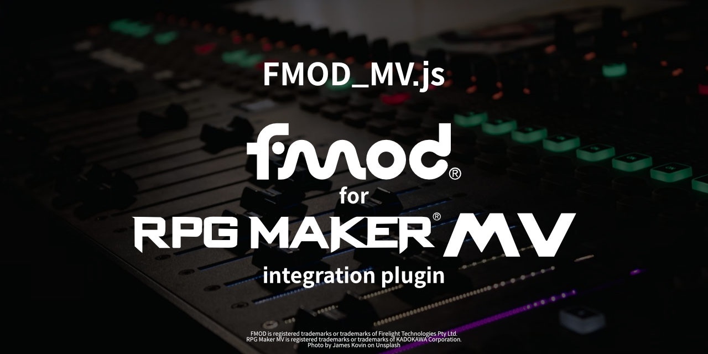
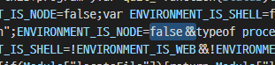
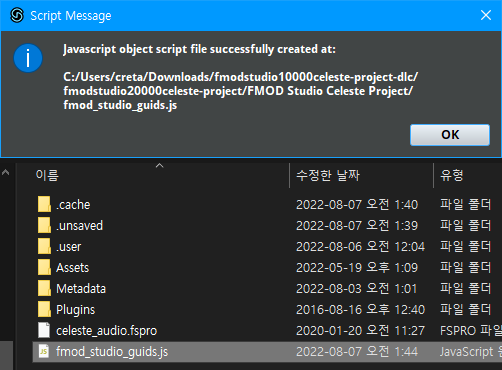

# FMOD_MV.js

<p align="center">
  
</p>

### [플러그인 다운로드][releases]

이 플러그인은 Firelight Technologies Pty Ltd의 FMOD를 적용합니다.  
게임 업계 최고의 오디오 엔진을 RPG 만들기 MV에 사용해 보세요.

제작 : Creta Park (https://creft.me/cretapark)

이 플러그인의 라이선스는 MIT 라이선스의 변형을 사용하므로,
아래의 조건을 준수하는 한 자유롭게 사용할 수 있습니다.

아래의 라이센스 허가 조건을 준수하세요.

1. 이 플러그인을 다른 소프트웨어와 함께 사용하는 경우,
   소프트웨어는 RPG 만들기로 개발 및 제작 된 게임이어야 하며,
   게임의 크레딧에는 `FMOD_MV.js by Creta Park`가 반드시 들어가야 합니다.

2. 1의 내용을 FMOD의 저작권 표기와 혼동해서는 안 됩니다.  
   FMOD의 저작자 표기와 완전히 별개로 표기하세요.

3. 이 플러그인의 원본 또는 수정된 버전이나
   개별 구성 요소는 단독으로 판매될 수 없습니다.

4. 수정 후 재배포를 하는 경우, 원저작자를 반드시 표기해야 합니다.

*이 내용은 [LICENSE][LICENSE] 파일에서도 찾을 수 있습니다.*

---

## FMOD가 뭔가요?

FMOD는 소리를 처리하고 관리하는 오디오 미들웨어(Middleware)입니다.  
주로 비디오 게임에 사용되며 적응형 오디오를 사용하는 데 도움이 됩니다.

자세한 내용은 아래에 Scruffy님이 요약한 동영상을 확인하세요.

<p align="center">
  <a href="https://youtu.be/p-FLWabby4Y">
    
  </a>
</p>

## 만들게 된 배경

이 플러그인은 [1맵 1치킨 알만툴 대회][1map-twitter]에서 주최하는 게임잼 이벤트인
[2022 1치킨 게임잼][1map]을 위해 만들었습니다.

이번 게임잼에 참여해서 만든 게임은 DOWNFALLEN(다운폴른)이었고,
이 게임에 맞는 플러그인을 만들 수 있는 기회가 만들어졌기 때문입니다.

[여기에서 플레이 할 수 있습니다][DOWNFALLEN].

## 데모

어떤 기능을 하는 지 궁금하시다면 이 영상을 확인하세요.

<p align="center">
  <a href="https://youtu.be/YcVaRldGb4c">
    
  </a>
</p>

## 목차

- 1\. [기본적인 지식 요구사항](#1-기본적인-지식-요구사항)
- 2\. [플러그인의 한계](#2-플러그인의-한계)
- 3\. [프로젝트 준비 작업](#3-프로젝트-준비-작업)
  * 3.1. [플러그인 추가하기](#31-플러그인-추가하기)
  * 3.2. [FMOD 엔진 추가하기](#32-fmod-엔진-추가하기)
- 4\. [예제 빨리 확인하기](#4-예제-빨리-확인하기)
- 5\. [플러그인 설정](#5-플러그인-설정)
  * 5.1. [최대 메모리](#51-최대-메모리)
  * 5.2. [뱅크 파일 경로](#52-뱅크-파일-경로)
  * 5.3. [사용할 뱅크 파일들](#53-사용할-뱅크-파일들)
  * 5.4. [GUID 스크립트 경로](#54-guid-스크립트-경로)
  * 5.5. [연동할 VCA들](#55-연동할-vca들)
  * 5.6. [시스템 음악(BGM)들](#56-시스템-음악bgm들)
  * 5.7. [시스템 음악 효과음(ME)들](#57-시스템-음악-효과음me들)
  * 5.8. [시스템 효과음(SE)들](#58-시스템-효과음se들)
- 6\. [사용법](#6-사용법)
  * 6.1. [FMOD_MV.js에서 이벤트가 동작하는 방식](#61-fmod_mvjs에서-이벤트가-동작하는-방식)
  * 6.2. [이벤트 재생하기](#62-이벤트-재생하기)
    + 6.2.1. [BGM 재생](#621-bgm-재생)
    + 6.2.2. [BGS 재생](#622-bgs-재생)
    + 6.2.3. [ME 재생](#623-me-재생)
    + 6.2.4. [SE 재생](#624-se-재생)
  * 6.3. [이벤트 제어하기](#63-이벤트-제어하기)
    + 6.3.1. [BGM 정지](#631-bgm-정지)
    + 6.3.2. [BGM 파라미터 지정](#632-bgm-파라미터-지정)
    + 6.3.3. [BGM 카테고리의 이벤트가 재생 중인지 확인](#633-bgm-카테고리의-이벤트가-재생-중인지-확인)
    + 6.3.4. [BGS 정지](#634-bgs-정지)
    + 6.3.5. [BGS 파라미터 지정](#635-bgs-파라미터-지정)
    + 6.3.6. [BGS 카테고리의 이벤트가 재생 중인지 확인](#636-bgs-카테고리의-이벤트가-재생-중인지-확인)
    + 6.3.7. [ME 정지](#637-me-정지)
    + 6.3.8. [ME 파라미터 지정](#638-me-파라미터-지정)
    + 6.3.9. [ME 카테고리의 이벤트가 재생 중인지 확인](#639-me-카테고리의-이벤트가-재생-중인지-확인)
    + 6.3.10. [SE 정지](#6310-se-정지)
  * 6.4. [스피커](#64-스피커)
    + 6.4.1. [대상 스피커의 이벤트 정지](#641-대상-스피커의-이벤트-정지)
    + 6.4.2. [대상 스피커의 이벤트 파라미터 지정](#642-대상-스피커의-이벤트-파라미터-지정)
    + 6.4.3. [대상 스피커가 기억하는 특정 이벤트의 파라미터 설정 지우기](#643-대상-스피커가-기억하는-특정-이벤트의-파라미터-설정-지우기)
    + 6.4.4. [대상 스피커가 기억하는 모든 이벤트의 파라미터 설정 지우기](#644-대상-스피커가-기억하는-모든-이벤트의-파라미터-설정-지우기)
    + 6.4.5. [GUID에 해당하는 이벤트가 바인딩 됐는지 확인](#645-GUID에-해당하는-이벤트가-바인딩-됐는지-확인)
  * 6.5. [스냅샷 제어하기](#65-스냅샷-제어하기)
    + 6.5.1. [스냅샷 시작](#651-스냅샷-시작)
    + 6.5.2. [스냡샷 중단](#652-스냅샷-중단)

# [1.][toc] 기본적인 지식 요구사항

- Knows how to use FMOD Studio.

- Well aware of the [license][fmod-license], [attribution][fmod-attribution]
  and [legal information][fmod-legal] of FMOD.


# [2.][toc] 플러그인의 한계

이 플러그인은 거의 일주일이라는 짧은 기간에 만들어졌기 때문에,
이 플러그인을 사용한 게임인 DOWNFALLEN에 포함되지 않은 일부
RPG 만들기의 기능이나 FMOD의 일부 기능이 현재 누락된 상태입니다.  
제가 이 플러그인을 알파 단계로 출시한 이유죠.

풀 리퀘스트나 기여는 언제나 환영입니다!

현재 제가 확인한 한계는 다음과 같습니다.

- 도플러 효과 등의 속도  
  RPG Maker의 캐릭터는 이동 속도가 매우 일정하기 때문에,
  속도를 적용했을 때 결과가 너무 이상해서 구현하지 않았습니다.

- RPG Maker의 기본 오디오 시스템을 FMOD로 스트리밍  
  FMOD는 외부 오디오 버퍼를 읽어서 버스를 통해
  출력하는 기능이 있지만 아직 구현되지 않았습니다.

- RPG Maker 리소스의 FMOD 이벤트 인스턴스 생성  
  FMOD는 오디오 파일에서 이벤트 인스턴스를 생성할 수도 있습니다.  
  하지만 RPG Maker의 암복호화 파이프라인을   어떻게 해결하고 구현할 지는 아직 정해지지 않았습니다.

- 청취자(Listener) 위치와 다른 카메라 플러그인 호환성 확인 안 됨  
  카메라를 확대, 축소 또는 제어하는 다른 카메라 플러그인이 있는 경우,
  입체 사운드가 제대로 들리지 않을 수 있습니다.  
  직접 호환되게 만드려고 하는 경우, `FMOD_MV.js`에서
  `Game_Map.prototype.updateListenerAttributes`를 찾으세요.  
  여기에는 청취자의 위치를 ​​업데이트하는 코드가 포함되어 있습니다.

- 이벤트 콜백을 지원할 수 없습니다.  
  이벤트 콜백은 FMOD 스튜디오에서 생성한 이벤트에 호출 함수를 넣으면
  게임에서 이 신호를 받는 기능입니다.  
  기본적으로 박자 당 호출 등과 같은 기능을 제공합니다.
  
  이 문제는 제 플러그인 설계의 큰 실수입니다.
  
  콜백은 FMOD의 이벤트에 대해 등록할 수 있지만, 등록을 취소할 수는 없습니다.  
  이는 FMOD가 이벤트를 인스턴스화 하면 한 번 사용한 다음 버려진다고 가정하기 때문이라 생각하고 있습니다.
  
  또, FMOD에는 자체 개체 풀링(Object pooling)을 지원합니다.
  
  하지만 저는 이것을 알지 못한 채로 인스턴스화된 이벤트의 풀링을 구현했고,
  여기에 위와 같은 문제로 인해 자연스럽게 콜백을 사용할 수 없는 상황이 되었습니다.
  
  이 실수는 현재 이 플러그인의 가장 큰 기술 부채입니다.

- 전투와 관련된 모든 기능
  DOWNFALLEN을 만들 때 전투 기능을 사용 할 필요가 없었기 때문입니다.

# [3.][toc] 프로젝트 준비 작업

## [3.1.][toc] 플러그인 추가하기


`plugins` 폴더에 `FMOD_MV.js`를 넣고 RPG 만들기 프로젝트에서 이 플러그인을 추가합니다.  
추가 오디오 관련 기능 플러그인을 사용하지 않는 한 플러그인의 순서는 중요하지 않습니다.

## [3.2.][toc] FMOD 엔진 추가하기

  
[여기에서 FMOD 엔진을 다운로드 하세요][fmod-download], HTML5 버전이 필요합니다.  
지금은 `2.01.13` 버전을 사용하세요, 제가 검증을 끝낸 버전입니다. (DOWNFALLEN에서 잘 작동함)  
[이 스레드에 그 이유가 정리되어 있습니다][nwjs-problem].

  
위에서 `2.01.13` 버전의 엔진을 다운로드했으니,
문제를 최소화하기 위해 스튜디오 프로그램도 `2.01.13` 버전을 사용하는 것을 권장합니다.

  
다운로드한 압축(zip) 파일에서 `api/studio/lib/upstream/wasm`에 있는
`fmodstudio.js`와 `fmodstudio.wasm`을 프로젝트 폴더의 `js/lib`에 넣습니다.

  
그런 다음, `fmodstudio.js`을 텍스트 편집기로 연 후, 아래의 구문을 찾으세요.
```js
ENVIRONMENT_IS_NODE=typeof process==="object"&&typeof process
```
`ENVIRONMENT_IS_NODE=` 뒤에 `false&&`를 쓴 후, 저장하세요.

그런 다음, 프로젝트 폴더의 `index.html`을 열고, `<body>` 태그 안에 아래와 같이 한 줄을 추가합니다.

```
<script type="text/javascript" src="js/libs/fmodstudio.js"></script>
```

새 프로젝트로 만든 `index.html`에서 작업한 경우 아래와 같은 모습이 됩니다.

```diff
 <!DOCTYPE html>
 <html>
     <head>
         <meta charset="UTF-8">
         <meta name="apple-mobile-web-app-capable" content="yes">
         <meta name="apple-mobile-web-app-status-bar-style" content="black-translucent">
         <meta name="viewport" content="user-scalable=no">
         <link rel="icon" href="icon/icon.png" type="image/png">
         <link rel="apple-touch-icon" href="icon/icon.png">
         <link rel="stylesheet" type="text/css" href="fonts/gamefont.css">
         <title>Project1</title>
     </head>
     <body style="background-color: black">
         <script type="text/javascript" src="js/libs/pixi.js"></script>
         <script type="text/javascript" src="js/libs/pixi-tilemap.js"></script>
         <script type="text/javascript" src="js/libs/pixi-picture.js"></script>
         <script type="text/javascript" src="js/libs/fpsmeter.js"></script>
         <script type="text/javascript" src="js/libs/lz-string.js"></script>
         <script type="text/javascript" src="js/libs/iphone-inline-video.browser.js"></script>
+        <script type="text/javascript" src="js/libs/fmodstudio.js"></script>
         <script type="text/javascript" src="js/rpg_core.js"></script>
         <script type="text/javascript" src="js/rpg_managers.js"></script>
         <script type="text/javascript" src="js/rpg_objects.js"></script>
         <script type="text/javascript" src="js/rpg_scenes.js"></script>
         <script type="text/javascript" src="js/rpg_sprites.js"></script>
         <script type="text/javascript" src="js/rpg_windows.js"></script>
         <script type="text/javascript" src="js/plugins.js"></script>
         <script type="text/javascript" src="js/main.js"></script>
     </body>
 </html>
```

준비는 모두 끝났습니다!

# [4.][toc] 예제 빨리 확인하기

바로 동작하는 예제를 확인하려면 새로 RPG 만들기 프로젝트를 만들고,
저장소에 포함된 `plugins.js`를 새로 만든 프로젝트 폴더의 `js/plugins.js`에 덮어씁니다.

  
  
그런 다음, [Celeste FMOD 스튜디오 프로젝트][fmod-learning-resources]를 빌드하고,
[뱅크 파일 경로](#52-뱅크-파일-경로),
[사용할 뱅크 파일들](#53-사용할-뱅크-파일들),
[GUID 스크립트 경로](#54-guid-스크립트-경로) 항목을 확인하고 준비합니다.

마지막으로 소리의 방향과 위치를 명확하게 파악할 수 있도록 맵을 최대한 크게(75x75 이상) 만듭니다.

왜냐하면 Celeste의 공간은 RPG 만들기의 공간보다 크기 때문입니다.  
(Celeste는 타일당 `8`만큼 사용되기 때문에 RPG 만들기의 타일당 `1`보다 큼)

테스트 플레이를 시작하면, 커서 및 타이틀 음악이 Celeste의 소리로 나오는 것을 확인 할 수 있습니다.

설정을 마쳤다면, 이 항목 이후로 [사용법](#6-사용법) 항목에서
이 설정을 기반으로 만든 프로젝트를 통해 모든 예제를 직접 확인할 수 있습니다.

# [5.][toc] 플러그인 설정

  
이 항목에서는 플러그인 설정을 다룹니다.

## [5.1.][toc] 최대 메모리

FMOD의 가상 메모리의 최대 크기입니다. (바이트 단위)  
기본값은 `64MB`입니다. (`64 * 1024 * 1024`)

## [5.2.][toc] 뱅크 파일 경로

FMOD에 사용할 뱅크 파일이 있는 경로를 지정합니다.  
기본 경로는 `audio/bank` 입니다.

  
FMOD 스튜디오에서 빌드하여 만든 뱅크 파일은 모두 이 경로에 있어야 합니다.

## [5.3.][toc] 사용할 뱅크 파일들

불러올 뱅크 파일을 지정합니다.  
마스터 뱅크 및 마스터 뱅크의 문자열 뱅크는 기본적으로 추가해야 합니다.  
예를 들어 `Master Bank.bank`, `Master Bank.strings.bank`, `Music.bank`가 있다면,
이 설정에 `Master Bank`, `Master Bank.strings`, `Music`을 추가하면 됩니다.

## [5.4.][toc] GUID 스크립트 경로

GUID가 담겨있는 스크립트 파일의 위치를 지정합니다.  
기본 설정은 `audio/bank/fmod_studio_guids.js`.  
이제부터 이걸 **`GUID 스크립트`**라고 부르겠습니다.


**`GUID 스크립트`** 파일(`fmod_studio_guids.js`)은 아래와 같은 과정을 통해 만들 수 있습니다.

1. **이 저장소의 `exportGUIDsHeader.js`를 FMOD 스튜디오의 스크립트 파일에 덮어씁니다.**  
     
   FMOD 스튜디오가 설치된 폴더에 `scripts`라는 폴더가 있습니다.  
   그 안에 있는 스크립트 파일을 덮어씁니다.

2. **FMOD 스튜디오의 메뉴에서 `Scripts/FMOD Examples/Export GUIDs Header/js File`을 선택하여 만듭니다.**  
     
   그러면 FMOD 스튜디오는 **`GUID 스크립트`**를 만든 후, 현재 작업 중인 프로젝트 파일과 동일한 위치에 `fmod_studio_guids.js`로 저장합니다.  
     
   > 참고 : 생성된 스크립트(`fmod_studio_guids.js`)파일에 의도치 않게 이벤트 이름 중복이
   > 발생할 수 있으며, 이렇게 되면 오류로 인해 스크립트가 작동하지 않게 됩니다.  
   > FMOD 스튜디오를 다시 시작하고 **`GUID 스크립트`**를 다시 만들어서 해결할 수 있습니다.

3. **생성된 스크립트를 플러그인 옵션에서 설정한 경로로 옮깁니다.**  
   

이게 다에요!

## [5.5.][toc] 연동할 VCA들

각 채널 유형에 사용되는 VCA를 지정합니다.  
이것들을 비워두면 FMOD_MV.js는 `BGM`, `BGS`, `ME`, `SE`가 포함된 VCA 이름을 찾으려고 시도합니다.  
이들을 찾으면 자동으로 해당 VCA를 사용됩니다.

지정 가능한 VCA 이름은 [**`GUID 스크립트`**][guids-js]의 `VCA`에서 에서 찾을 수 있습니다.

## [5.6.][toc] 시스템 음악(BGM)들

시스템 음악(BGM)을 FMOD 이벤트로 대체합니다.  
각 항목은 해당 시스템 음악에 해당합니다.  
공란으로 두면, RPG 만들기에서 설정한 음악으로 재생됩니다.
(RPG 만들기 오디오 시스템 기반)

![guid-events-location][guid-events-location]

지정 가능한 이벤트 이름은 [**`GUID 스크립트`**][guids-js]의 `Event`에서 에서 찾을 수 있습니다.

> 참고 : 전투 관련 시스템 항목은 추후 업데이트를 위해 준비되어 있는 항목입니다.  
> 전투 관련 부분은 아직 구현되지 않아 의도하지 않은 동작이 발생할 수 있습니다.

## [5.7.][toc] 시스템 음악 효과음(ME)들

시스템 음악 효과음(ME)을 FMOD 이벤트로 대체합니다.  
각 항목은 해당 시스템 음악 효과음에 해당합니다.  
공란으로 두면, RPG 만들기에서 설정한 음악 효과음으로 재생됩니다.
(RPG 만들기 오디오 시스템 기반)

![guid-events-location][guid-events-location]

지정 가능한 이벤트 이름은 [**`GUID 스크립트`**][guids-js]의 `Event`에서 에서 찾을 수 있습니다.

> 참고 : 전투 관련 시스템 항목은 추후 업데이트를 위해 준비되어 있는 항목입니다.  
> 전투 관련 부분은 아직 구현되지 않아 의도하지 않은 동작이 발생할 수 있습니다.

## [5.8.][toc] 시스템 효과음(SE)들

시스템 효과음(ME)을 FMOD 이벤트로 대체합니다.  
각 항목은 해당 시스템 효과음에 해당합니다.  
공란으로 두면, RPG 만들기에서 설정한 효과음으로 재생됩니다.
(RPG 만들기 오디오 시스템 기반)

![guid-events-location][guid-events-location]

지정 가능한 이벤트 이름은 [**`GUID 스크립트`**][guids-js]의 `Event`에서 에서 찾을 수 있습니다.

# [6.][toc] 사용법

FMOD_MV.js는 RPG 만들기와 가능한 통일된 구조를 가지도록 설계했습니다.
하지만 아직 RPG 만들기의 모든 기능을 구현하지는 못했습니다.  
(자세한 내용은 [2. 플러그인의 한계](#2-플러그인의-한계)를 확인하세요)

이 항목의 예제들은 [예제 빨리 확인하기](#5-quick-example)에서 안내한 대로
설정한 프로젝트를 준비한 경우, 직접 확인할 수 있습니다!

여기에 나오는 모든 가이드는 **스크립트 이벤트**를 기반으로 합니다.

## [6.1.][toc] FMOD_MV.js에서 이벤트가 동작하는 방식

기본적으로 FMOD에서 모든 소리는 이벤트이지만, 여기에서는 재생하려는 이벤트의 카테고리를
`BGM`, `BGS`, `ME`, `SE`로 지정 할 수 있습니다.  
앞서 언급했듯이 RPG 만들기와 기능적 요소를 통일하는 데 중점을 두고 있기 때문입니다.  
예를 들어 `BGM` 나 `BGS` 카테고리로 재생한 이벤트들은 세이브에 상태가 기록되고, 불러올 때 다시 재생됩니다.


또, FMOD_MV.js에서는 모든 캐릭터 요소(예: 맵 상의 이벤트, 플레이어 캐릭터, 파티원, 탑승물 등)에
[스피커](#64-스피커)라는 개념이 구현되어 있습니다.

[스피커](#64-스피커)들은 대상에 소리 이벤트가 붙도록 작동합니다.  
FMOD 이벤트가 3D일 때 스테레오 사운드로 나오는 것과 같은 기능들을 사용할 수 있습니다.

그러니 이를 잘 기억해두세요.


소리가 있으면 소리를 들어줄 청취자(Listener)가 있어야 합니다.  
기본적으로 청취자는 그림과 같이 캐릭터들이 있는 위치(깊이)에서
`10(-Z)`만큼 뒤에서 정면을 향하게 배치되어 있습니다.

청취자는 항상 카메라의 중심점에 있습니다.

이렇게 설계한 이유는 결국 플레이어가 화면을 통해서 RPG 만들기 게임을 하기 때문입니다.  
또, 리스너를 `10`만큼 뒤로 거리를 둔 이유는, 소리가 청취자(플레이어)의 머리를 '통과'하는 것처럼
느껴지지 않도록 하기 위해서입니다.

그렇기 때문에 FMOD 스튜디오에서 이벤트를 디자인 할 때 청취자가 항상 `10`만큼 떨어져 있다는 점을 염두하세요.

## [6.2.][toc] 이벤트 재생하기

### [6.2.1.][toc] BGM 재생

```js
FMOD_MV.PlayBGM(guid, isAppend, immediateStop);
```

Plays Event as BGM category.

- `guid` : The Event GUID you want to play in the BGM category.  
  You can use the event defined in [**`GUID 스크립트`**][guids-js].  
  If you're not sure what to put in, check out the example below.

- `isAppend` : (Optional) Determines whether to play a new BGM event while leaving the playing BGM as it is.  
  Acceptable value is `true` for yes, `false` for no, and default is `false`.

- `immediateStop` : (Optional) Determines how the FMOD stops previously playing music.  
  If not set immediate stop, the event will be stopped gradually as the behavior defined for the Event in FMOD Studio.  
  Acceptable value is `true` for yes, `false` for no, and default is `false`.

**Example**

1. Play `music_lvl1_main` Event with slowly stopping the previous BGM Events.
   ```js
   FMOD_MV.PlayBGM(FMOD_FSPRO.Event.music_lvl1_main);
   ```

2. Overlaying `music_lvl1_theo` Event.
   ```js
   FMOD_MV.PlayBGM(FMOD_FSPRO.Event.music_lvl1_theo, true);
   ```

3. Immediately stop the BGM Events being played and play `music_lvl2_chase` Event.
   ```js
   FMOD_MV.PlayBGM(FMOD_FSPRO.Event.music_lvl2_chase, false, true);
   ```

### [6.2.2.][toc] BGS 재생

```js
FMOD_MV.PlayBGS(guid, isAppend, immediateStop);
```

Plays Event as BGS category.

- `guid` : The Event GUID you want to play in the BGS category.  
  You can use the event defined in [**`GUID 스크립트`**][guids-js].  
  If you're not sure what to put in, check out the example below.

- `isAppend` : (Optional) Determines whether to play a new BGS event while leaving the playing BGS as it is.  
  Acceptable value is `true` for yes, `false` for no, and default is `false`.

- `immediateStop` : (Optional) Determines how the FMOD stops previously playing music.  
  If not set immediate stop, the event will be stopped gradually as the behavior defined for the Event in FMOD Studio.  
  Acceptable value is `true` for yes, `false` for no, and default is `false`.

**Example**

This is similar to [BGM 재생](#621-bgm-재생), check out the [BGM 재생](#621-bgm-재생)'s example.  
The only difference is that BGM is replaced as BGS. (`FMOD_MV.PlayBGS(...)`)

### [6.2.3.][toc] ME 재생

```js
FMOD_MV.PlayME(guid, immediateStop);
```

Plays Event as ME category.  
As with RPG Maker, when an event in the ME category is triggered, the BGM remembers the state and goes into a stopped state.  
When all MEs are finished or stopped, the BGM recalls what it remembered and plays it again.

> Note : FMOD Events played in this category will not be recorded in save file.

- `guid` : The Event GUID you want to play in the ME category.  
  You can use the event defined in [**`GUID 스크립트`**][guids-js].  
  If you're not sure what to put in, check out the example below.

- `immediateStop` : (Optional) Determines how the FMOD stops previously playing music.  
  If not set immediate stop, the event will be stopped gradually as the behavior defined for the Event in FMOD Studio.  
  Acceptable value is `true` for yes, `false` for no, and default is `false`.

**Example**

1. Play `ui_postgame_strawberry_total_all` Event with slowly stopping the previous ME Events.
   ```js
   FMOD_MV.PlayME(FMOD_FSPRO.Event.ui_postgame_strawberry_total_all);
   ```

2. Play `ui_postgame_strawberry_total_all` while immediately stopping the previous ME Events.
   ```js
   FMOD_MV.PlayME(FMOD_FSPRO.Event.ui_postgame_strawberry_total_all, true);
   ```

### [6.2.4.][toc] SE 재생

```js
FMOD_MV.PlaySE(guid, at, parameters);
```

Plays Event as SE category.  
It has the most functions, please read carefully and check it with examples.

> Note : FMOD Events played in this category will not be recorded in save file.

- `guid` : The Event GUID you want to play in the SE category.  
  You can use the event defined in [**`GUID 스크립트`**][guids-js].  
  If you're not sure what to put in, check out the example below.

- `at` : (Optional) Specifies where the sound is coming from.  
  Acceptable values are below, default is `null`(none).
  
  - `this` is for RPG Maker event itself that executing this script.  
    There's also have explicit expression as `this.event()`.  
    It will be bound to this character's `Speaker`.
  
  - `$gamePlayer` is for player character.  
    It will be bound to player character's `Speaker`.
  
  - `$gameMap.event(<ID>)` is for RPG Maker event in current map by ID.  
    In example, if you want make sound to RPG Maker event with ID 12 then use `$gameMap.event(12)`.  
    It will be bound to target RPG Maker event character's `Speaker`.
  
  - `{x:<X>,y:<Y>}` is for only specifying sound's location.  
    In example, if you want make sound to event on `X:51`, `Y:64` then use `{x:51,y:64}`.  
    You can also use this to mix multiple expressions like `{x:51,y:$gamePlayer.y}`, `{x:$gameMap.event(24).x,y:this.event().y}`...

- `parameters` : (Optional) Specifies the Event parameters before start Event.  
  It is designed to allow multiple parameters to be specified.  
  It follows the syntax below.  
  ```json
  {
    "<Parameter Name 1>": [<Value>, <Immediate Set>],
    "<Parameter Name 2>": [<Value>, <Immediate Set>],
    "<Parameter Name 3>": [<Value>, <Immediate Set>]
  }
  ```
  - `Parameter Name` : Specifies parameter name for Event.
  
  - `Value` : The value to assign to the corresponding parameter.  
    FMOD Studio allows you to specify different formats for parameters, but these formats are all numeric as a result.
  
  - `Immediate Set` : Specifies that this parameter will be assigned directly.  
    Acceptable value is `true` for yes, `false` for no.
  
  For detailed usage examples, please refer to the **Example** below.

**Example**

1. Play `game_general_spring` at camera position.
   ```js
   FMOD_MV.PlaySE(FMOD_FSPRO.Event.game_general_spring);
   ```

2. Play `game_general_spring` at this event.
   ```js
   FMOD_MV.PlaySE(FMOD_FSPRO.Event.game_general_spring, this);
   ```

3. Play `game_general_spring` at RPG Maker event with `ID:1`.
   ```js
   FMOD_MV.PlaySE(FMOD_FSPRO.Event.game_general_spring, $gameMap.event(1));
   ```

4. Play `char_madeline_footstep` at player, with set parameter `surface_index` to `5`.
   ```js
   FMOD_MV.PlaySE(FMOD_FSPRO.Event.char_madeline_footstep, $gamePlayer, {
     "surface_index": [5, true]
   });
   ```

5. Play `char_madeline_footstep` at player, with set parameter `surface_index` as player's located region ID.
   ```js
   FMOD_MV.PlaySE(FMOD_FSPRO.Event.char_madeline_footstep, $gamePlayer, {
     "surface_index": [$gameMap.regionId($gamePlayer.x, $gamePlayer.y), true]
   });
   ```
     
   Put this example inside an invisible parallel processing RPG Maker event with a `15 frame` wait, then place the Region tiles in RPG Maker like this image.  
   You can hear footstep sounds when walk around there with the player.

> Note : If you want to change a parameter that is playing in the middle
> or stop a specific FMOD Event on the target, please refer to the [Speaker](#64-스피커) section.

## [6.3.][toc] 이벤트 제어하기

### [6.3.1.][toc] BGM 정지

```js
FMOD_MV.StopBGM(immediateStop, specifiedGuid);
```

Stops the BGM categorized Event.

- `immediateStop` : (Optional) Specifies whether to stop the Event immediately.  
  If not set immediate stop, the event will be stopped gradually as the behavior defined for the Event in FMOD Studio.  
  Acceptable value is `true` for yes, `false` for no, and default is `false`.

- `specifiedGuid` : (Optional) The Event you want to stop in the BGM category.  
  You can use the event defined in [**`GUID 스크립트`**][guids-js].  
  If you're not sure what to put in, check out the example below.
  Default is `null`(all events).

**Example**

These examples assume after starting the FMOD Event in the example of [BGM 재생](#621-bgm-재생).

1. Stops all BGM categorized events.
   ```js
   FMOD_MV.StopBGM();
   ```

2. Stops all BGM categorized events immediately.
   ```js
   FMOD_MV.StopBGM(true);
   ```

3. Stops specific BGM. (`music_lvl1_main` in this case)
   ```js
   FMOD_MV.StopBGM(false, FMOD_FSPRO.Event.music_lvl1_main);
   ```

4. Stops specific BGM immediately. (`music_lvl1_main` in this case)
   ```js
   FMOD_MV.StopBGM(true, FMOD_FSPRO.Event.music_lvl1_main);
   ```

### [6.3.2.][toc] BGM 파라미터 지정

```js
FMOD_MV.SetBGMParameter(guid, name, value, skip);
```

Set the event parameter in BGM categorized specific event.

- `guid` : The Event GUID you want to set parameter in the BGM category.  
  You can use the event defined in [**`GUID 스크립트`**][guids-js].  
  If you're not sure what to put in, check out the example below.

- `name` : The parameter name you want to specify in the event.  
  Double quotation marks (`"`) must be placed around the name.  
  (like `"progress"`, `"stinger"`)

- `value` : A numeric value to set for the parameter you want to assign.  
  The range of this value is the range set in FMOD Studio for the parameter you put in the target Event.

- `skip` : Whether to override the acceleration setting of the parameter
  specified in FMOD Studio and immediately assign the parameter's value.  
  Acceptable value is `true` for yes, `false` for no, and default is `false`.

**Example**

This example assume after starting the FMOD Event, `music_lvl1_main` in the example of [BGM 재생](#621-bgm-재생).

1. Set Event `music_lvl1_main`'s parameter, `layer1` to `0` and `layer3` to `0`.  
   > Note : This example assume after starting the FMOD Event,
   > `music_lvl1_main` in the example of [BGM 재생](#621-bgm-재생)'s first example.
   ```js
   FMOD_MV.SetBGMParameter(FMOD_FSPRO.Event.music_lvl1_main, "layer1", 0);
   FMOD_MV.SetBGMParameter(FMOD_FSPRO.Event.music_lvl1_main, "layer3", 0);
   ```

2. Set Event `music_lvl1_main`'s parameter, `layer1` to `0` and `layer2` to `0` and `layer3` to `1` immediately.  
   > Note : This example assume after starting the FMOD Event,
   > `music_lvl1_main` in the example of [BGM 재생](#621-bgm-재생)'s first example.
   ```js
   FMOD_MV.SetBGMParameter(FMOD_FSPRO.Event.music_lvl1_main, "layer1", 0, true);
   FMOD_MV.SetBGMParameter(FMOD_FSPRO.Event.music_lvl1_main, "layer2", 0, true);
   FMOD_MV.SetBGMParameter(FMOD_FSPRO.Event.music_lvl1_main, "layer3", 1, true);
   ```

3. BGM 정지 events and play `music_lvl6_main` then set parameter `layer2` to `1` immediately.  
   > Note : [`PlayBGM`](#621-bgm-재생) automatically stops it's categorized events
   > before starting event if additional option not set.
   ```js
   FMOD_MV.PlayBGM(FMOD_FSPRO.Event.music_lvl6_main);
   FMOD_MV.SetBGMParameter(FMOD_FSPRO.Event.music_lvl6_main, "layer2", 1, true);
   ```

### [6.3.3.][toc] BGM 카테고리의 이벤트가 재생 중인지 확인

```js
FMOD_MV.BGMIsPlaying(guid)
```

Check if the event is playing in the BGM category.

> Note : Even when the event is stopping, it is detected as being played.

- `guid` : (Optional) The Event you want to check is playing in the BGM category.  
  You can use the event defined in [**`GUID 스크립트`**][guids-js].  
  If you're not sure what to put in, check out the example below.  
  Default is `null`(any events is playing in BGM).

**Example**

With or without `music_lvl1_main` being played as BGM, you can check both dialogues by inserting the following events into the event you want to check, and interacting with them.

```
◆ Condition : Script : FMOD_MV.BGMIsPlaying(FMOD_FSPRO.Event.music_lvl1_main)
  ◆ Dialogue : music_lvl1_main is playing!
: Else
  ◆ Dialogue : music_lvl1_main is not playing...
:Condition End
```

### [6.3.4.][toc] BGS 정지

```js
FMOD_MV.StopBGS(immediateStop, specifiedGuid);
```

Stops the BGS categorized Event.

- `immediateStop` : (Optional) Specifies whether to stop the Event immediately.  
  If not set immediate stop, the event will be stopped gradually as the behavior defined for the Event in FMOD Studio.  
  Acceptable value is `true` for yes, `false` for no, and default is `false`.

- `specifiedGuid` : (Optional) The Event you want to stop in the BGS category.  
  You can use the event defined in [**`GUID 스크립트`**][guids-js].  
  If you're not sure what to put in, check out the example below.
  Default is `null`(all events).

**Example**

This is similar to [BGM 정지](#621-bgm-정지), check out the [BGM 정지](#621-bgm-정지)'s example.  
The only difference is that BGM is replaced as BGS. (`FMOD_MV.StopBGS(...)`)

### [6.3.5.][toc] BGS 파라미터 지정

```js
FMOD_MV.SetBGSParameter(guid, name, value, skip);
```

Set the event parameter in BGS categorized specific event.

- `guid` : The Event GUID you want to set parameter in the BGS category.  
  You can use the event defined in [**`GUID 스크립트`**][guids-js].  
  If you're not sure what to put in, check out the example below.

- `name` : The parameter name you want to specify in the event.  
  Double quotation marks (`"`) must be placed around the name.  
  (like `"progress"`, `"stinger"`)

- `value` : A numeric value to set for the parameter you want to assign.  
  The range of this value is the range set in FMOD Studio for the parameter you put in the target Event.

- `skip` : Whether to override the acceleration setting of the parameter
  specified in FMOD Studio and immediately assign the parameter's value.  
  Acceptable value is `true` for yes, `false` for no, and default is `false`.

**Example**

This is similar to [BGM 파라미터 지정](#622-bgm-파라미터-지정), check out the [BGM 파라미터 지정](#622-bgm-파라미터-지정)'s example.  
The only difference is that BGM is replaced as BGS. (`FMOD_MV.SetBGSParameter(...)`)

### [6.3.6.][toc] BGS 카테고리의 이벤트가 재생 중인지 확인

```js
FMOD_MV.BGSIsPlaying(guid)
```

Check if the event is playing in the BGS category.

> Note : Even when the event is stopping, it is detected as being played.

- `guid` : (Optional) The Event you want to check is playing in the BGS category.  
  You can use the event defined in [**`GUID 스크립트`**][guids-js].  
  If you're not sure what to put in, check out the example below.  
  Default is `null`(any events is playing in BGS).

**Example**

This is similar to [BGM 카테고리의 이벤트가 재생 중인지 확인](#623-bgm-카테고리의-이벤트가-재생-중인지-확인), check out the [BGM 카테고리의 이벤트가 재생 중인지 확인](#623-bgm-카테고리의-이벤트가-재생-중인지-확인)'s example.  
The only difference is that BGM is replaced as BGS. (`FMOD_MV.BGSIsPlaying(...)`)

### [6.3.7.][toc] ME 정지

```js
FMOD_MV.StopME(immediateStop, specifiedGuid);
```

Stops the ME categorized Event.

- `immediateStop` : (Optional) Specifies whether to stop the Event immediately.  
  If not set immediate stop, the event will be stopped gradually as the behavior defined for the Event in FMOD Studio.  
  Acceptable value is `true` for yes, `false` for no, and default is `false`.

- `specifiedGuid` : (Optional) The Event you want to stop in the ME category.  
  You can use the event defined in [**`GUID 스크립트`**][guids-js].  
  If you're not sure what to put in, check out the example below.  
  Default is `null`(all events).

**Example**

This is similar to [BGM 정지](#621-bgm-정지), check out the [BGM 정지](#621-bgm-정지)'s example.  
The only difference is that BGM is replaced as ME. (`FMOD_MV.StopME(...)`)

### [6.3.8.][toc] ME 파라미터 지정

```js
FMOD_MV.SetMEParameter(guid, name, value, skip);
```

Set the event parameter in ME categorized specific event.

- `guid` : The Event GUID you want to set parameter in the ME category.  
  You can use the event defined in [**`GUID 스크립트`**][guids-js].  
  If you're not sure what to put in, check out the example below.

- `name` : The parameter name you want to specify in the event.  
  Double quotation marks (`"`) must be placed around the name.  
  (like `"progress"`, `"stinger"`)

- `value` : A numeric value to set for the parameter you want to assign.  
  The range of this value is the range set in FMOD Studio for the parameter you put in the target Event.

- `skip` : Whether to override the acceleration setting of the parameter
  specified in FMOD Studio and immediately assign the parameter's value.  
  Acceptable value is `true` for yes, `false` for no, and default is `false`.

**Example**

This is similar to [BGM 파라미터 지정](#622-bgm-파라미터-지정), check out the [BGM 파라미터 지정](#622-bgm-파라미터-지정)'s example.  
The only difference is that BGM is replaced as ME. (`FMOD_MV.SetMEParameter(...)`)

### [6.3.9.][toc] ME 카테고리의 이벤트가 재생 중인지 확인

```js
FMOD_MV.MEIsPlaying(guid)
```

Check if the event is playing in the ME category.

> Note : Even when the event is stopping, it is detected as being played.

- `guid` : (Optional) The Event you want to check is playing in the ME category.  
  You can use the event defined in [**`GUID 스크립트`**][guids-js].  
  If you're not sure what to put in, check out the example below.  
  Default is `null`(any events is playing in ME).

**Example**

This is similar to [BGM 카테고리의 이벤트가 재생 중인지 확인](#623-bgm-카테고리의-이벤트가-재생-중인지-확인), check out the [BGM 카테고리의 이벤트가 재생 중인지 확인](#623-bgm-카테고리의-이벤트가-재생-중인지-확인)'s example.  
The only difference is that BGM is replaced as BGS. (`FMOD_MV.BGSIsPlaying(...)`)

### [6.3.10.][toc] SE 정지

```js
FMOD_MV.StopSE(immediateStop, specifiedGuid);
```

Stops the SE categorized Event.

- `immediateStop` : (Optional) Specifies whether to stop the Event immediately.  
  If not set immediate stop, the event will be stopped gradually as the behavior
  defined for the Event in FMOD Studio.  
  Acceptable value is `true` for yes, `false` for no, and default is `false`.

- `specifiedGuid` : (Optional) The Event you want to stop in the SE category.  
  You can use the event defined in [**`GUID 스크립트`**][guids-js].  
  If you're not sure what to put in, check out the example below.  
  Default is `null`(all events).
  > Note : If you want to stop the sound from the speaker of
  > a specific character(like player, event, etc.), check the [Speaker](#64-스피커) section.

## [6.4.][toc] 스피커

Speaker is made for make the sound as if it is coming from the target
by attributing the FMOD Event, or to manage the parameters of
a specific Event separately.

Remember that you can manage parameters separately by attributing
specific sounds as well.

Events that are playing on the speaker are automatically removed
from the speaker when playback ends.

Speakers can be obtained from characters such as events or player.

**Example**

> Note : After this section, the target for finding the speaker below
> is denoted as `(target)`.

1. Get the speaker of the player
   ```js
   $gamePlayer.speaker()
   ```

2. Get the speaker of the event that is executing script
   ```js
   this.event().speaker()
   ```

3. Get the speaker of the specific event with `ID:1`.
   ```js
   $gameMap.event(1).speaker()
   ```

### [6.4.1.][toc] 대상 스피커의 이벤트 정지

```js
(target).speaker().stopEvent(immediateStop, specifiedGuid);
```

Stops target Speaker's Event.

- `immediateStop` : (Optional) Specifies whether to stop the Event immediately.  
  If not set immediate stop, the event will be stopped gradually as the behavior defined for the Event in FMOD Studio.  
  Acceptable value is `true` for yes, `false` for no, and default is `false`.

- `specifiedGuid` : (Optional) The Event you want to stop in target Speaker's binded Event.  
  You can use the event defined in [**`GUID 스크립트`**][guids-js].  
  If you're not sure what to put in, check out the example below.
  Default is `null`(all events).

**Example**

These examples assume after starting the FMOD Event in the 2, 3, 4, 5 example of [SE 재생][play-se].

1. Stops all events of target Speaker.
   ```js
   (target).speaker().stopEvent();
   ```

2. Stops all events of target Speaker immediately.
   ```js
   (target).speaker().stopEvent(true);
   ```

3. Stops specific (`game_general_spring` in this case) Event of target Speaker
   ```js
   (target).speaker().stopEvent(false, FMOD_FSPRO.Event.game_general_spring);
   ```

4. Stops specific (`game_general_spring` in this case) Event of target Speaker immediately.
   ```js
   (target).speaker().stopEvent(true, FMOD_FSPRO.Event.game_general_spring);
   ```

### [6.4.2.][toc] 대상 스피커의 이벤트 파라미터 지정

```js
(target).speaker().setParameter(guid, name, value, skip);
```

Set the event parameter in this speaker's specific event.

If you specify a parameter for the corresponding event GUID,
Speaker remembers the set value of the parameter and assigns each parameter of the binded event
with the corresponding ID to the memorized value.

Parameters set for the event character's Speaker operating on the current map
or player character's Speaker are saved in the game save.

- `guid` : The Event GUID you want to set parameter in this speaker.  
  You can use the event defined in [**`GUID 스크립트`**][guids-js].  
  If you're not sure what to put in, check out the example below.

- `name` : The parameter name you want to specify in the event.  
  Double quotation marks (`"`) must be placed around the name.  
  (like `"progress"`, `"stinger"`)

- `value` : A numeric value to set for the parameter you want to assign.  
  The range of this value is the range set in FMOD Studio for the parameter you put in the target Event.

- `skip` : Whether to override the acceleration setting of the parameter
  specified in FMOD Studio and immediately assign the parameter's value.  
  Acceptable value is `true` for yes, `false` for no, and default is `false`.

**Example**

This example assumes runs script below.
```js
FMOD_MV.PlaySE(FMOD_FSPRO.Event.char_dialogue_madeline, <target>);
```
Playing `char_dialogue_madeline` event in SE category to the `<target>` via [PlaySE][play-se].

As you can see this in [Celeste FMOD Studio project](#4-quick-example),
this event is always playing, so only can stop this event by manually stop it.

Use [대상 스피커의 이벤트 정지](#631-대상-스피커의-이벤트-정지) in this example's case.

1. Start talking sound in normal by setting parameter `dialogue_portrait` to `1`.
   ```js
   (target).speaker().setParameter(FMOD_FSPRO.Event.char_dialogue_madeline, "dialogue_portrait", 1);
   ```

2. Pause talking sound by setting parameter  `dialogue_end` to `1` and `dialogue_portrait` to `0`.
   ```js
   (target).speaker().setParameter(FMOD_FSPRO.Event.char_dialogue_madeline, "dialogue_end", 1);
   (target).speaker().setParameter(FMOD_FSPRO.Event.char_dialogue_madeline, "dialogue_portrait", 0);
   ```

3. Resume talking sound in surprised by setting parameter  `dialogue_end` to `0` and `dialogue_portrait` to `6`.
   ```js
   (target).speaker().setParameter(FMOD_FSPRO.Event.char_dialogue_madeline, "dialogue_end", 0);
   (target).speaker().setParameter(FMOD_FSPRO.Event.char_dialogue_madeline, "dialogue_portrait", 6);
   ```

### [6.4.3.][toc] 대상 스피커가 기억하는 특정 이벤트의 파라미터 설정 지우기

```js
(target).speaker().clearParameter(guid);
```

Clears all parameter settings memorized with the specified event GUID in target Speaker.

> Note : Since this is a function that clears the memorized parameter settings,
> so the parameter settings of the already playing event are not set to the initial values.

- `guid` : The Event GUID you want to set parameter in this speaker.  
  You can use the event defined in [**`GUID 스크립트`**][guids-js].  
  If you're not sure what to put in, check out the example below.

**Example**

Clears the parameter settings memorized as `char_dialogue_madeline` on the target speaker.

```js
(target).speaker().clearParameter(FMOD_FSPRO.Event.char_dialogue_madeline);
```

### [6.4.4.][toc] 대상 스피커가 기억하는 모든 이벤트의 파라미터 설정 지우기

```js
(target).speaker().clearAllParameter();
```

Clears all parameter settings memorized of all event GUID in target Speaker.

> Note : Since this is a function that clears the memorized parameter settings,
> so the parameter settings of the already playing event are not set to the initial values.

### [6.4.5.][toc] GUID에 해당하는 이벤트가 바인딩 됐는지 확인

```js
(target).speaker().isBinded(guid)
```

Checks if there is an event that is active on the target speaker through the event GUID.

- `guid` : The Event GUID you want to set parameter in this speaker.  
  You can use the event defined in [**`GUID 스크립트`**][guids-js].  
  If you're not sure what to put in, check out the example below.

**Example**

This example shows...

- There is no `env_local_03_resort_broken_window_large` binded to the speaker of
  `this`(RPG Maker event that executing this script) which is the `(target)` then...

- play `env_local_03_resort_broken_window_large` as an SE category in `this`(RPG Maker event that executing this script).  

- If else then waits 60 frame(s).

Put the event contents below into an parallel processing transparent event.

```
◆ Condition : Script : this.speaker().isBinded(FMOD_FSPRO.Event.env_local_03_resort_broken_window_large)
  ◆ Wait : 60 frame(s)
: Else
  ◆ Script : FMOD_MV.PlaySE(FMOD_FSPRO.Event.env_local_03_resort_broken_window_large, this);
:Condition End
```

Since the sound effects are not saved in the game save, so you can use this method to play the 3D ambient sound infinitely.

> Note : You can also check this replacing event to `env_local_03_resort_broken_window_small`.

> Note : When routing events to FMOD's Bus/VCA, local environment sounds (for example, sound of wind `env_local_03_resort_broken_window_large` of this example) are should routed to BGS, and when using them in RPG Maker, I recommended to use [PlaySE][play-se].
> 
> With FMOD, the boundaries between sound effects and environmental sounds have become very blurred as we begin to separate the space of sounds.
> 
> So watch carefully and use them appropriately when using real FMOD events in Bus/VCA Routing and RPG Maker's BGM/BGS/ME/SE category.
> 
> And don't forget that the playback state of BGM/BGS is saved in the save.

## [6.5.][toc] 스냅샷 제어하기


Snapshot is a function that applies or subtracts presets made in advance of the Bus
settings that manage output in FMOD.

This allows you to apply or subtract echo effects when entering a specific area,
and dynamically change the sound output in specific situations.

The active state of the snapshots is saved in the game's save.  
When game is return to the title screen, they are all disabled.

> Note : If you want to control your own from the title screen,
> please search `Scene_Title.prototype.playTitleMusic` in plugin's source code.

### [6.5.1.][toc] 스냅샷 시작

```js
FMOD_MV.StartSnapshot(guid);
```

Enables target snapshot.

Note that the GUID used here must be the GUID of `Snapshot`, not `Event`.

- `guid` : The snapshot GUID you want to start.  
  You can use the snapshots defined in [**`GUID 스크립트`**][guids-js].  
  If you're not sure what to put in, check out the example below.

**Example**

These examples assume after starting the FMOD Event in the example of [BGM 재생](#621-bgm-재생).

This example activates `pause_menu`, a snapshot
that controls the Bus to which music events are routed.

```js
FMOD_MV.StartSnapshot(FMOD_FSPRO.Snapshot.pause_menu);
```

You can hear how it feels as if you are listening to a sound while you are wrapped in a pillow.

### [6.5.2.][toc] 스냡샷 중단

```js
FMOD_MV.StopSnapshot(immediateStop, specifiedGuid);
```

Stops snapshot.

- `immediateStop` : (Optional) Specifies whether to stop the snapshot immediately.  
  If not set immediate stop, the snapshot will be stopped gradually as the behavior defined for the snapshot in FMOD Studio.  
  Acceptable value is `true` for yes, `false` for no, and default is `false`.

- `specifiedGuid` : (Optional) The Snapshot you want to stop.  
  You can use the snapshot defined in [**`GUID 스크립트`**][guids-js].  
  If you're not sure what to put in, check out the example below.
  Default is `null`(all snapshot).

**Example**

These examples assume after starting the FMOD Event in the example of [BGM 재생](#621-bgm-재생).

1. Stops all snapshots.
   ```js
   FMOD_MV.StopSnapshot();
   ```

2. Stops all snapshots immediately.
   ```js
   FMOD_MV.StopSnapshot(true);
   ```

3. Stops specific snapshot. (`pause_menu` in this case)
   ```js
   FMOD_MV.StopSnapshot(false, FMOD_FSPRO.Event.pause_menu);
   ```

4. Stops specific snapshot immediately. (`pause_menu` in this case)
   ```js
   FMOD_MV.StopSnapshot(true, FMOD_FSPRO.Event.pause_menu);
   ```

[releases]: https://github.com/creta5164/fmod-rmmv/releases
[LICENSE]: https://github.com/creta5164/fmod-rmmv/blob/main/LICENSE
[1map]: https://1map1chicken.com/entries/jam2022
[1map-twitter]: https://twitter.com/1map1chicken
[DOWNFALLEN]: https://1map1chicken.com/entries/jam2022/downfallen-다운폴른
[fmod]: https://www.fmod.com
[fmod-license]: https://www.fmod.com/licensing
[fmod-attribution]: https://www.fmod.com/attribution
[fmod-legal]: https://www.fmod.com/legal
[fmod-download]: https://www.fmod.com/download#fmodengine
[fmod-learning-resources]: https://www.fmod.com/download#learningresources
[nwjs-problem]: https://qa.fmod.com/t/problem-with-html5-build-on-nw-js/19116
[toc]: #목차
[guids-js]: #54-guid-스크립트-경로
[guid-events-location]: ./img/guid-events-location.png
[play-se]: #624-se-재생