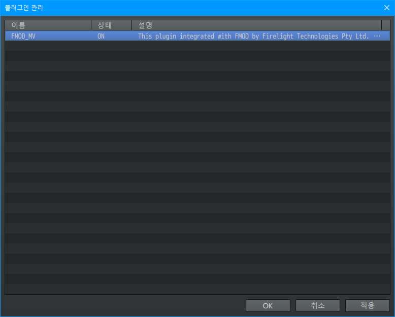
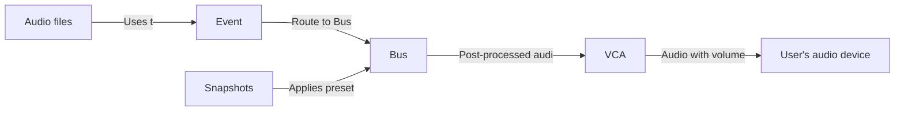

# FMOD_MV.js

<p align="center">
  
  <br>
  <a href="./README-ko.md">한국어 메뉴얼 보기</a>
</p>

This plugin integrated with FMOD by Firelight Technologies Pty Ltd.  
You can use industry-leading audio engine for RPG Maker MV.

Created by Creta Park (https://creft.me/cretapark)

---

## License notice

This plugin's license is a variant of the MIT License,
so you are free to use it as long as you comply with these terms.

1. When using this plugin with other software, the software must be
   a game developed and made with RPG Maker, and `FMOD_MV.js by Creta Park`
   must be written in the credit of these game.

2. Should not be confused 1's content with the attribution of FMOD.  
   Mark completely separate from the attribution of the FMOD.

3. Neither this plugin nor any of its individual components,
   in Original or Modified Versions, may be sold by itself.

4. When redistributed after modification, the original author must be indicated.

*This can also be found in the [LICENSE][LICENSE] file.*

## Disclaimer

This repository is not sponsored by or affiliated with Firelight Technologies Pty Ltd.  
"FMOD" is registered trademarks or trademarks of Firelight Technologies Pty Ltd.

This plugin is for integrates the FMOD Engine into RPG Maker MV,
the name "FMOD" in the plugin's name was used because to highlight the user's understanding due to this feature.

---

## What is FMOD?

FMOD is an audio middleware that processes and manages sound.  
Mainly used for video games, it helps you use adaptive audio.

For more details, please watch this video summarized by Scruffy.

<p align="center">
  <a href="https://youtu.be/p-FLWabby4Y">
    
  </a>
</p>

## Background

This plugin was created for the [2022 1Chicken game jam contest][1map],
a game jam event hosted by [1Map1Chicken RPG Maker contest][1map-twitter] in Korea.

The game we made by participating in this game jam was DOWNFALLEN,
and it was the opportunity to create the corresponding plug-in for this game.

[You can play it here][DOWNFALLEN].

## Demonstration

If you curious what it does, watch this video.

<p align="center">
  <a href="https://youtu.be/YcVaRldGb4c">
    
  </a>
</p>

## Table of content

- 1\. [Basic knowledge requirements](#1-basic-knowledge-requirements)
- 2\. [Limitation](#2-limitation)
  * 2.1. [Compatible status list of plugins](#21-compatible-status-list-of-plugins)
- 3\. [Setup project](#3-setup-project)
  * 3.1. [Add plugin to your project](#31-add-plugin-to-your-project)
  * 3.2. [Add FMOD Engine](#32-add-fmod-engine)
- 4\. [Quick example](#4-quick-example)
- 5\. [Plugin options](#5-plugin-options)
  * 5.1. [Total memory](#51-total-memory)
  * 5.2. [Bank asset path](#52-bank-asset-path)
  * 5.3. [Bank assets](#53-bank-assets)
  * 5.4. [GUIDs js path](#54-guids-js-path)
  * 5.5. [Integrated VCAs](#55-integrated-vcas)
  * 5.6. [Listener is player](#56-listener-is-player)
  * 5.7. [Save event's time state](#57-save-events-time-state)
  * 5.8. [System musics](#58-system-musics)
  * 5.9. [System music effects](#59-system-music-effects)
  * 5.10. [System sound effects](#510-system-sound-effects)
- 6\. [How to use](#6-how-to-use)
  * 6.1. [How Events work in FMOD_MV.js](#61-how-events-work-in-fmod_mvjs)
  * 6.2. [Playing event](#62-playing-event)
    + 6.2.1. [Play BGM](#621-play-bgm)
    + 6.2.2. [Play BGS](#622-play-bgs)
    + 6.2.3. [Play ME](#623-play-me)
    + 6.2.4. [Play SE](#624-play-se)
  * 6.3. [Controls event](#63-controls-event)
    + 6.3.1. [Stop BGM](#631-stop-bgm)
    + 6.3.2. [Set BGM Parameter](#632-set-bgm-parameter)
    + 6.3.3. [Check BGM categorized event is playing](#633-check-bgm-categorized-event-is-playing)
    + 6.3.4. [Stop BGS](#634-stop-bgs)
    + 6.3.5. [Set BGS Parameter](#635-set-bgs-parameter)
    + 6.3.6. [Check BGS categorized event is playing](#636-check-bgs-categorized-event-is-playing)
    + 6.3.7. [Stop ME](#637-stop-me)
    + 6.3.8. [Set ME Parameter](#638-set-me-parameter)
    + 6.3.9. [Check ME categorized event is playing](#639-check-me-categorized-event-is-playing)
    + 6.3.10. [Stop SE](#6310-stop-se)
  * 6.4. [Speaker](#64-speaker)
    + 6.4.1. [Stop Event of target speaker](#641-stop-event-of-target-speaker)
    + 6.4.2. [Set specific event's parameter of target speaker](#642-set-specific-event-s-parameter-of-target-speaker)
    + 6.4.3. [Clear specific memorized event parameter settings of Speaker](#643-clear-specific-memorized-event-parameter-settings-of-speaker)
    + 6.4.4. [Clear all memorized event parameter settings of Speaker](#644-clear-all-memorized-event-parameter-settings-of-speaker)
    + 6.4.5. [Check any Event of specified GUID is binded](#645-check-any-event-of-specified-guid-is-binded)
  * 6.5. [Control snapshots](#65-control-snapshots)
    + 6.5.1. [Start snapshot](#651-start-snapshot)
    + 6.5.2. [Stop snapshot](#652-stop-snapshot)

# [1.][toc] Basic knowledge requirements

- Knows how to use FMOD Studio.

- Well aware of the [license][fmod-license], [attribution][fmod-attribution]
  and [legal information][fmod-legal] of FMOD.


# [2.][toc] Limitation

This plug-in was made in a short period of almost a week,
so some RPG Maker features that were not contained from DOWNFALLEN,
the game that used this plug-in or some features of FMOD, are missed for now.  
That's the reason I released this plugin as alpha stage.

Pull request or contribution are always welcome!

Currently, the limitations I have identified are as follows.

- Stable with newest `NW.js` runtime  
  Recently discovered native memory allocation issue since `alpha-1.0.4`,
  I'm currently investigating the cause.  
  Since this issue does not occur in the latest `NW.js` runtime,
  if you want to use it stable as possible, please update `NW.js`.  
  As of `NW.js` `0.66.0`, there were no major problems.

- Velocity for doppler effect, etc  
  The characters in RPG Maker have very consistent movement speeds,
  so when I applied velocity to them, the results were very strange
  so I didn't implement it.

- Streaming RPG Maker's native audio system to FMOD  
  FMOD has a feature that helps to read an external audio buffer
  and output it through the bus, but this has not been
  implemented yet.

- Create FMOD Event instance of RPG Maker's resources  
  FMOD can also create Event instances from audio files.  
  However, it has not been decided how to solve and implement RPG Maker's encryption/decryption pipeline.

- Compatibility verification with 3rd party plugins is not done much.  
  This plugin was created for use when developing [DOWNFALLEN][DOWNFALLEN],
  and it is a plugin that has been verified in an environment where third-party plugins are not used a lot.  
  For a list of third-party plugins that may or may not work, see [Compatible status list of plugins][compatiability] below.

- Can't support event callbacks  
  Event callback is a feature that receives this signal from the game
  when a call function is put in an event created in FMOD Studio.  
  It also provides basic functions such as beat per callbacks, etc.  
  
  Anyways, this is a big mistake in my plugin design.
  
  Callbacks can be registered for events in the FMOD, but cannot be unregistered.  
  This is presumably because the FMOD assumes that the event is
  instantiated and used once and then discarded.
  
  FMOD also provides its own object pooling system.
  
  However, I implemented the pooling of the instanced event without knowing this,
  and the above problems resulted in an environment where callbacks could not be used naturally.
  
  Currently, this mistake is the biggest technical debt for this plugin.

- All of the battle related features  
  Since we didn't have to use it while making DOWNFALLEN.

# [2.1.][toc] Compatible status list of plugins

Before list up of plugins, here's main problems of compatibility, includes how to resolve them.  
(resolving requires few programming knowledge)

- Listener position and third-party camera plug-in compatibility unverified  
  If you have a third-party camera plug-in that zooms in, zooms out or controls the camera, there is a chance that the sound won't sound right.  
  🛠️ If you want to make them compatible directly, search `Game_Map.prototype.updateListenerAttributes` in the `FMOD_MV.js`.  
  This contains the code to update the listener's position.

- Plugins that override character movement behavior may not work with [speakers][speaker]  
  FMOD events that work with binaural sound may not work as I intended with these movement plugins.  
  🛠️ If you want to make them compatible directly, search `Game_CharacterBase.prototype.update` in the `FMOD_MV.js`.  
  This contains the code to process the speaker logic.

| Plugin name             | Checked version | Author     | Type     | Compatible | Note and resolve guide |
|-------------------------|-----------------|------------|----------|------------|:-----------------------|
| `DirectorView`          | `1.0.1`         | Creta Park | Camera   | Yes        | ⭕ This plugin was utilized in the development of [DOWNFALLEN][DOWNFALLEN]. |
| `SRD_CameraCore`        | `1.05`          | SumRndmDde | Camera   | Partially  | ⭕ Confirmed that the camera position works normally.<br>❌ Haven't verified with zooming in and out feature, so if the listener's position is a camera and zooming is used, stereo sound may not work as intended.<br>🛠️ N/A |
| `SuperOrangeMovement`   | `1.5.1`         | Hudell     | Movement | Yes        | ⭕ This plugin's Ex plugin was utilized when developing [DOWNFALLEN][DOWNFALLEN]. |
| `SuperOrangeMovementEx` | `1.5.2`         | Hudell     | Movement | Yes        | ⭕ This plugin was utilized in the development of [DOWNFALLEN][DOWNFALLEN]. |
| `QMovement`             | `1.6.3`         | Quxios     | Movement | No         | ❌ The position of [speaker][speaker] is not updated because the plugin does not call an existing method in the character handling action.<br>🛠️ Put update speaker code (Available in `FMOD_MV.js`'s `Game_CharacterBase.prototype.update`) into below of `Game_CharacterBase.prototype.update` method in this plugin. |

If you experienced any other compatibility status, please report on the [Issues][issues] page.

# [3.][toc] Setup project

## [3.1.][toc] Add plugin to your project



Put `FMOD_MV.js` in the `plugins` folder, and then add the plugin in your RPG Maker project.  
Plugin's order doesn't matter, unless you're using additional audio-related featured plugins.

## [3.2.][toc] Add FMOD Engine

  
[Download FMOD Engine at here][fmod-download], it requires HTML5 version.

  
Put `fmodstudio.js` and `fmodstudio.wasm` in `api/studio/lib/upstream/wasm` of the downloaded zip file into `js/lib` in the project folder.

  
Then open `fmodstudio.js` with text editor and find the section
```js
ENVIRONMENT_IS_NODE=typeof process==="object"&&typeof process
```
Add `false&&` after `ENVIRONMENT_IS_NODE=` and save it.  

> Note : This modification is to force the FMOD engine to run in the web environment.  
> The reason is explained in [this thread][nwjs-problem].

Then, open `index.html` in the project folder, and add a line
like the following inside the `<body>` tag before tag that contained `rpg_core.js`.

```
<script type="text/javascript" src="js/libs/fmodstudio.js"></script>
```

If you've been working on the `index.html` you created as a new project, it should look like this :

```diff
 <!DOCTYPE html>
 <html>
     <head>
         <meta charset="UTF-8">
         <meta name="apple-mobile-web-app-capable" content="yes">
         <meta name="apple-mobile-web-app-status-bar-style" content="black-translucent">
         <meta name="viewport" content="user-scalable=no">
         <link rel="icon" href="icon/icon.png" type="image/png">
         <link rel="apple-touch-icon" href="icon/icon.png">
         <link rel="stylesheet" type="text/css" href="fonts/gamefont.css">
         <title>Project1</title>
     </head>
     <body style="background-color: black">
         <script type="text/javascript" src="js/libs/pixi.js"></script>
         <script type="text/javascript" src="js/libs/pixi-tilemap.js"></script>
         <script type="text/javascript" src="js/libs/pixi-picture.js"></script>
         <script type="text/javascript" src="js/libs/fpsmeter.js"></script>
         <script type="text/javascript" src="js/libs/lz-string.js"></script>
         <script type="text/javascript" src="js/libs/iphone-inline-video.browser.js"></script>
+        <script type="text/javascript" src="js/libs/fmodstudio.js"></script>
         <script type="text/javascript" src="js/rpg_core.js"></script>
         <script type="text/javascript" src="js/rpg_managers.js"></script>
         <script type="text/javascript" src="js/rpg_objects.js"></script>
         <script type="text/javascript" src="js/rpg_scenes.js"></script>
         <script type="text/javascript" src="js/rpg_sprites.js"></script>
         <script type="text/javascript" src="js/rpg_windows.js"></script>
         <script type="text/javascript" src="js/plugins.js"></script>
         <script type="text/javascript" src="js/main.js"></script>
     </body>
 </html>
```

Then you are ready to go!

# [4.][toc] Quick example

To see an quick example in action, create a new RPG Maker project,
and overwrite the `plugins.js` enclosed in the repository with `js/plugins.js` in your newly created project directory.

  
  
And then build the [Celeste FMOD Studio Project][fmod-learning-resources], and setup them by referring to
[Bank asset path](#52-bank-asset-path),
[Bank assets](#53-bank-assets),
and [GUIDs js path](#54-guids-js-path) in this section.

> **Note : If the Celeste FMOD Studio project used in this document is used for**
> **purposes other than checking examples, legal problems may arise.**

Make the map as large as possible (75x75 or larger) so that you can clearly
determine the direction and location of the sounds.

Because the space in Celeste is larger than in RPG Maker.  
(Celeste uses 8 units per tile, so larger than 1 unit per tile in RPG Maker)

When you start the test play, you can check that the system sounds and title music are played of Celeste's audio.

Now you can check directly at the examples based on this setup
in the [How to use](#6-how-to-use) section after this section.

# [5.][toc] Plugin options

  
This section covers the plugin options menu.

## [5.1.][toc] Total memory

FMOD's virtual memories' maximum size. (byte units)  
Default setting is `64MB`. (`64 * 1024 * 1024`)

## [5.2.][toc] Bank asset path

Specify the path where the FMOD's Bank assets are.  
Default setting is `audio/bank`.

  
Bank files created by building in FMOD Studio must all be in the this path.

## [5.3.][toc] Bank assets

Specify banks to load.  
Master bank and it's strings must be assigned.  
i.e. if you have `Master Bank.bank`, `Master Bank.strings.bank`, `Music.bank` then
you should add `Master Bank`, `Master Bank.strings`, `Music` at this option.

## [5.4.][toc] GUIDs js path

Specify GUID collection script file.  
Default setting is `audio/bank/fmod_studio_guids.js`.  
From now on, we'll call it **`GUID script`**.


**`GUID script`** file(`fmod_studio_guids.js`) can be generated by the following below process.

1. **Overwrite `exportGUIDsHeader.js` in this repository to your FMOD Studio's scripts file**  
     
   There is a folder called `scripts` in the folder where FMOD Studio is installed, overwrite the script file in it.

2. **Export GUIDs header in FMOD Studio's menu : `Scripts/FMOD Examples/Export GUIDs Header/js File`.**  
     
   Then FMOD Studio will generate **`GUID script`** and save as `fmod_studio_guids.js` in the same location as the project file you are currently working on.  
     
   > Note : If there is an unintentional duplicate of the event name
   > in generated script(`fmod_studio_guids.js`) file, this script will not work due to an error.  
   > This possibly can resolved by restarting FMOD Studio, and creating the **`GUID script`** again.

3. **Move the generated script to the path in plugin option.**  
   

That's it!  

## [5.5.][toc] Integrated VCAs

Specify which VCA is used for each types of channels.  
If you leave these blank, FMOD_MV.js will try finds a VCA name
with `BGM`, `BGS`, `ME`, `SE`, if found them then
it will be used automatically.

Applicable VCA names can be found in `VCA` of [**`GUID script`**][guids-js].

## [5.6.][toc] Listener is player

Specifies listener is player or not(camera).

Default setting is `OFF`.

## [5.7.][toc] Save event's time state

When saving during gameplay, whether to save the timeline time positions of all events being played.

Default setting is `ON`.

## [5.8.][toc] System musics

Replaces system music with FMOD events.  
Each item corresponds to the corresponding system music.  
If you leave it blank, it will be played as the music set by RPG Maker. (RM Audio based)

![guid-events-location][guid-events-location]

Applicable event names can be found in `Event` of [**`GUID script`**][guids-js].

> Note : Battle-related system audio assignments are available for future use.  
> Battle-related parts are not implemented yet, so unintended behavior may occur.

## [5.9.][toc] System music effects

Replaces system music effect(ME) with FMOD events.  
Each item corresponds to the corresponding system music effects.  
If you leave it blank, it will be played as the music effect set by RPG Maker. (RM Audio based)

![guid-events-location][guid-events-location]

Applicable event names can be found in `Event` of [**`GUID script`**][guids-js].

> Note : Battle-related system audio assignments are available for future use.  
> Battle-related parts are not implemented yet, so unintended behavior may occur.

## [5.10.][toc] System sound effects

Replaces system sound effect(SE) with FMOD events.  
Each item corresponds to the corresponding system sound effects.  
If you leave it blank, it will be played as the sound effect set by RPG Maker. (RM Audio based)

![guid-events-location][guid-events-location]

Applicable event names can be found in `Event` of [**`GUID script`**][guids-js].

# [6.][toc] How to use

FMOD_MV.js is designed in a way to maintain as much unity as possible with RPG Maker.  
However, it has not yet been implemented to harmonize with all functions of RPG Maker.  
(Refer to [2. Limitation](#2-limitation) for details)

The example scripts in this section can be tried directly in [Quick example](#5-quick-example)
if you have created a project set up as instructed in that project!

All guides presented here are based on **script event**.

## [6.1.][toc] How Events work in FMOD_MV.js

Basically, in FMOD, every sound is an event, but here I made the concept of a category to classify the event into `BGM`, `BGS`, `ME`, `SE`.  
As mentioned earlier, this is because the focus is on unifying the functional elements with RPG Maker.  
Such as assigning the Event played in the `BGM` and `BGS` categories in the save and replaying them when they are recalled.


And in FMOD_MV.js, the concept is implemented that called [Speaker](#64-speaker), in all character elements (e.g. events on the map, player characters, party members, vehicles, etc.).

[Speakers](#64-speaker) work so that sound is attached to a specific object.  
This is for supports features such as stereo sound when FMOD events are 3D are available.

So keep this in mind.


If there is a sound, then there must be a listener to hear the sound.  
Basically, the listener is a structure facing the front from the back `10 units (-Z)` from the position (depth) where the characters are as shown in the figure.

Listeners are always being at the camera's center point.  
If you enabled of [Listener is player][listener-is-player] option, it'll always being at player's position.

The reason I designed it this way is that after all, the player plays RPG Maker game through the screen.  
And the reason I've put the listener at a distance of `10 units` is to make sure the sound doesn't feel like it's going 'through' the listener(the player)'s head.

So, when you designing an Event in FMOD Studio, keep in mind that the listener is always `10 units` apart.

## [6.2.][toc] Playing event

### [6.2.1.][toc] Play BGM

```js
FMOD_MV.PlayBGM(guid, isAppend, immediateStop);
```

Plays Event as BGM category.

- `guid` : The Event GUID you want to play in the BGM category.  
  You can use the event guids defined in [**`GUID script`**][guids-js].  
  If you're not sure what to put in, check out the example below.

- `isAppend` : (Optional) Determines whether to play a new BGM event while leaving the playing BGM as it is.  
  Acceptable value is `true` for yes, `false` for no, and default is `false`.

- `immediateStop` : (Optional) Determines how the FMOD stops previously playing music.  
  If not set immediate stop, the event will be stopped gradually as the behavior defined for the Event in FMOD Studio.  
  Acceptable value is `true` for yes, `false` for no, and default is `false`.

**Example**

1. Play `music_lvl1_main` Event with slowly stopping the previous BGM Events.
   ```js
   FMOD_MV.PlayBGM(FMOD_FSPRO.Event.music_lvl1_main);
   ```

2. Overlaying `music_lvl1_theo` Event.
   ```js
   FMOD_MV.PlayBGM(FMOD_FSPRO.Event.music_lvl1_theo, true);
   ```

3. Immediately stop the BGM Events being played and play `music_lvl2_chase` Event.
   ```js
   FMOD_MV.PlayBGM(FMOD_FSPRO.Event.music_lvl2_chase, false, true);
   ```

### [6.2.2.][toc] Play BGS

```js
FMOD_MV.PlayBGS(guid, isAppend, immediateStop);
```

Plays Event as BGS category.

- `guid` : The Event GUID you want to play in the BGS category.  
  You can use the event guids defined in [**`GUID script`**][guids-js].  
  If you're not sure what to put in, check out the example below.

- `isAppend` : (Optional) Determines whether to play a new BGS event while leaving the playing BGS as it is.  
  Acceptable value is `true` for yes, `false` for no, and default is `false`.

- `immediateStop` : (Optional) Determines how the FMOD stops previously playing music.  
  If not set immediate stop, the event will be stopped gradually as the behavior defined for the Event in FMOD Studio.  
  Acceptable value is `true` for yes, `false` for no, and default is `false`.

**Example**

This is similar to [Play BGM](#621-play-bgm), check out the [Play BGM](#621-play-bgm)'s example.  
The only difference is that BGM is replaced as BGS. (`FMOD_MV.PlayBGS(...)`)

### [6.2.3.][toc] Play ME

```js
FMOD_MV.PlayME(guid, immediateStop);
```

Plays Event as ME category.

As with RPG Maker, when an event in the ME category is triggered, the BGM remembers the state and goes into a stopped state.

When MEs are finished or stopped, the BGM recalls what it remembered and plays it again.

> Note : FMOD Events played in this category will not be recorded in save file.

- `guid` : The Event GUID you want to play in the ME category.  
  You can use the event guids defined in [**`GUID script`**][guids-js].  
  If you're not sure what to put in, check out the example below.

- `immediateStop` : (Optional) Determines how the FMOD stops previously playing music.  
  If not set immediate stop, the event will be stopped gradually as the behavior defined for the Event in FMOD Studio.  
  Acceptable value is `true` for yes, `false` for no, and default is `false`.

**Example**

1. Play `ui_postgame_strawberry_total_all` Event with slowly stopping the previous ME Events.
   ```js
   FMOD_MV.PlayME(FMOD_FSPRO.Event.ui_postgame_strawberry_total_all);
   ```

2. Play `ui_postgame_strawberry_total_all` while immediately stopping the previous ME Events.
   ```js
   FMOD_MV.PlayME(FMOD_FSPRO.Event.ui_postgame_strawberry_total_all, true);
   ```

### [6.2.4.][toc] Play SE

```js
FMOD_MV.PlaySE(guid, at, parameters);
```

Plays Event as SE category.  
It has the most functions, please read carefully and check it with examples.

> Note : FMOD Events played in this category will not be recorded in save file.

- `guid` : The Event GUID you want to play in the SE category.  
  You can use the event guids defined in [**`GUID script`**][guids-js].  
  If you're not sure what to put in, check out the example below.

- `at` : (Optional) Specifies where the sound is coming from.  
  Acceptable values are below, default is `null`(none, camera position).
  
  - `this` is for RPG Maker event itself that executing this script.  
    There's also have explicit expression as `this.event()`.  
    It will be bound to this event character's [Speaker](#64-speaker).
  
  - `$gamePlayer` is for player character.  
    It will be bound to player character's [Speaker](#64-speaker).
  
  - `$gameMap.event(<ID>)` is for RPG Maker event in current map by ID.  
    In example, if you want make sound to RPG Maker event with ID 12 then use `$gameMap.event(12)`.  
    It will be bound to target RPG Maker event character's [Speaker](#64-speaker).
  
  - `{x:<X>,y:<Y>}` is for only specifying sound's location.  
    In example, if you want make sound to event on `X:51`, `Y:64` then use `{x:51,y:64}`.  
    You can also use this to mix multiple expressions like `{x:51,y:$gamePlayer.y}`, `{x:$gameMap.event(24).x,y:this.event().y}`...

- `parameters` : (Optional) Specifies the Event parameters before start Event.  
  It is designed to allow multiple parameters to be specified.  
  It follows the syntax below.  
  ```json
  {
    "<Parameter Name 1>": [<Value>, <Immediate Set>],
    "<Parameter Name 2>": [<Value>, <Immediate Set>],
    "<Parameter Name 3>": [<Value>, <Immediate Set>]
  }
  ```
  - `Parameter Name` : Specifies parameter name for Event.
  
  - `Value` : The value to assign to the corresponding parameter.  
    FMOD Studio allows you to specify different formats for parameters, but these formats are all numeric as a result.
  
  - `Immediate Set` : Whether to override the acceleration setting of the parameter
    specified in FMOD Studio and immediately assign the parameter's value.  
    Acceptable value is `true` for yes, `false` for no.
  
  For detailed usage examples, please refer to the **Example** below.

**Example**

1. Play `game_general_spring` at camera position.
   ```js
   FMOD_MV.PlaySE(FMOD_FSPRO.Event.game_general_spring);
   ```

2. Play `game_general_spring` at this event.
   ```js
   FMOD_MV.PlaySE(FMOD_FSPRO.Event.game_general_spring, this);
   ```

3. Play `game_general_spring` at RPG Maker event with `ID:1`.
   ```js
   FMOD_MV.PlaySE(FMOD_FSPRO.Event.game_general_spring, $gameMap.event(1));
   ```

4. Play `char_madeline_footstep` at player, with set parameter `surface_index` to `5` immediately.
   ```js
   FMOD_MV.PlaySE(FMOD_FSPRO.Event.char_madeline_footstep, $gamePlayer, {
     "surface_index": [5, true]
   });
   ```

5. Play `char_madeline_footstep` at player, with set parameter `surface_index` as player's located region ID immediately.
   ```js
   FMOD_MV.PlaySE(FMOD_FSPRO.Event.char_madeline_footstep, $gamePlayer, {
     "surface_index": [$gameMap.regionId($gamePlayer.x, $gamePlayer.y), true]
   });
   ```
     
   Put this example inside an invisible parallel processing RPG Maker event with a `15 frame` wait, then place the Region tiles in RPG Maker like this image.  
   You can hear footstep sounds when walk around there with the player.

> Note : If you want to change a parameter that is playing in the middle
> or stop a specific FMOD Event on the target, please refer to the [Speaker](#64-speaker) section.

## [6.3.][toc] Controls event

### [6.3.1.][toc] Stop BGM

```js
FMOD_MV.StopBGM(immediateStop, specifiedGuid);
```

Stops the BGM categorized Event.

> Note : This only stops the audio on the FMOD side.

- `immediateStop` : (Optional) Specifies whether to stop the Event immediately.  
  If not set immediate stop, the event will be stopped gradually as the behavior defined for the Event in FMOD Studio.  
  Acceptable value is `true` for yes, `false` for no, and default is `false`.

- `specifiedGuid` : (Optional) The Event you want to stop in the BGM category.  
  You can use the event guids defined in [**`GUID script`**][guids-js].  
  If you're not sure what to put in, check out the example below.
  Default is `null`(all events).

**Example**

This example assume after starting the FMOD Event, `music_lvl1_main` in the example of [Play BGM](#621-play-bgm).

1. Stops all BGM categorized events.
   ```js
   FMOD_MV.StopBGM();
   ```

2. Stops all BGM categorized events immediately.
   ```js
   FMOD_MV.StopBGM(true);
   ```

3. Stops BGM of `music_lvl1_main`.
   ```js
   FMOD_MV.StopBGM(false, FMOD_FSPRO.Event.music_lvl1_main);
   ```

4. Stops BGM of `music_lvl1_main` immediately.
   ```js
   FMOD_MV.StopBGM(true, FMOD_FSPRO.Event.music_lvl1_main);
   ```

### [6.3.2.][toc] Set BGM Parameter

```js
FMOD_MV.SetBGMParameter(guid, name, value, immediateSet);
```

Set the event parameter in BGM categorized specific event.

- `guid` : The Event GUID you want to set parameter in the BGM category.  
  You can use the event guids defined in [**`GUID script`**][guids-js].  
  If you're not sure what to put in, check out the example below.

- `name` : The parameter name you want to specify in the event.  
  Double quotation marks (`"`) must be placed around the name.  
  (like `"progress"`, `"stinger"`)

- `value` : A numeric value to set for the parameter you want to assign.  
  The range of this value is the range set in FMOD Studio for the parameter you put in the target Event.

- `immediateSet` : Whether to override the acceleration setting of the parameter
  specified in FMOD Studio and immediately assign the parameter's value.  
  Acceptable value is `true` for yes, `false` for no, and default is `false`.

**Example**

This example assume after starting the FMOD Event, `music_lvl1_main` in the example of [Play BGM](#621-play-bgm).

1. Set Event `music_lvl1_main`'s parameter, `layer1` to `0` and `layer3` to `0`.  
   ```js
   FMOD_MV.SetBGMParameter(FMOD_FSPRO.Event.music_lvl1_main, "layer1", 0);
   FMOD_MV.SetBGMParameter(FMOD_FSPRO.Event.music_lvl1_main, "layer3", 0);
   ```

2. Set Event `music_lvl1_main`'s parameter, `layer1` to `0` and `layer2` to `0` and `layer3` to `1` immediately.  
   ```js
   FMOD_MV.SetBGMParameter(FMOD_FSPRO.Event.music_lvl1_main, "layer1", 0, true);
   FMOD_MV.SetBGMParameter(FMOD_FSPRO.Event.music_lvl1_main, "layer2", 0, true);
   FMOD_MV.SetBGMParameter(FMOD_FSPRO.Event.music_lvl1_main, "layer3", 1, true);
   ```

3. Stop BGM events and play `music_lvl6_main` then set parameter `layer2` to `1` immediately.  
   > Note : [`PlayBGM`](#621-play-bgm) automatically stops it's categorized events
   > before starting event if additional option not set.
   ```js
   FMOD_MV.PlayBGM(FMOD_FSPRO.Event.music_lvl6_main);
   FMOD_MV.SetBGMParameter(FMOD_FSPRO.Event.music_lvl6_main, "layer2", 1, true);
   ```

### [6.3.3.][toc] Check BGM categorized event is playing

```js
FMOD_MV.BGMIsPlaying(guid)
```

Check if the event is playing in the BGM category.

> Note : This only checks on the FMOD side.

> Note : Even when the event is stopping, it is detected as being played.

- `guid` : (Optional) The Event you want to check is playing in the BGM category.  
  You can use the event guids defined in [**`GUID script`**][guids-js].  
  If you're not sure what to put in, check out the example below.  
  Default is `null`(any events is playing in BGM).

**Example**

With or without `music_lvl1_main` being played as BGM, you can check both dialogues by inserting the following events into the event you want to check, and interacting with them.

```
◆ Condition : Script : FMOD_MV.BGMIsPlaying(FMOD_FSPRO.Event.music_lvl1_main)
  ◆ Dialogue : music_lvl1_main is playing!
: Else
  ◆ Dialogue : music_lvl1_main is not playing...
: Condition End
```

### [6.3.4.][toc] Stop BGS

```js
FMOD_MV.StopBGS(immediateStop, specifiedGuid);
```

Stops the BGS categorized Event.

> Note : This only stops the audio on the FMOD side.

- `immediateStop` : (Optional) Specifies whether to stop the Event immediately.  
  If not set immediate stop, the event will be stopped gradually as the behavior defined for the Event in FMOD Studio.  
  Acceptable value is `true` for yes, `false` for no, and default is `false`.

- `specifiedGuid` : (Optional) The Event you want to stop in the BGS category.  
  You can use the event guids defined in [**`GUID script`**][guids-js].  
  If you're not sure what to put in, check out the example below.
  Default is `null`(all events).

**Example**

This is similar to [Stop BGM](#631-stop-bgm), check out the [Stop BGM](#631-stop-bgm)'s example.  
The only difference is that BGM is replaced as BGS. (`FMOD_MV.StopBGS(...)`)

### [6.3.5.][toc] Set BGS Parameter

```js
FMOD_MV.SetBGSParameter(guid, name, value, immediateSet);
```

Set the event parameter in BGS categorized specific event.

- `guid` : The Event GUID you want to set parameter in the BGS category.  
  You can use the event guids defined in [**`GUID script`**][guids-js].  
  If you're not sure what to put in, check out the example below.

- `name` : The parameter name you want to specify in the event.  
  Double quotation marks (`"`) must be placed around the name.  
  (like `"progress"`, `"stinger"`)

- `value` : A numeric value to set for the parameter you want to assign.  
  The range of this value is the range set in FMOD Studio for the parameter you put in the target Event.

- `immediateSet` : Whether to override the acceleration setting of the parameter
  specified in FMOD Studio and immediately assign the parameter's value.  
  Acceptable value is `true` for yes, `false` for no, and default is `false`.

**Example**

This is similar to [Set BGM Parameter](#632-set-bgm-parameter), check out the [Set BGM Parameter](#632-set-bgm-parameter)'s example.  
The only difference is that BGM is replaced as BGS. (`FMOD_MV.SetBGSParameter(...)`)

### [6.3.6.][toc] Check BGS categorized event is playing

```js
FMOD_MV.BGSIsPlaying(guid)
```

Check if the event is playing in the BGS category.

> Note : This only checks on the FMOD side.

> Note : Even when the event is stopping, it is detected as being played.

- `guid` : (Optional) The Event you want to check is playing in the BGS category.  
  You can use the event guids defined in [**`GUID script`**][guids-js].  
  If you're not sure what to put in, check out the example below.  
  Default is `null`(any events is playing in BGS).

**Example**

This is similar to [Check BGM categorized event is playing](#633-check-bgm-categorized-event-is-playing), check out the [Check BGM categorized event is playing](#633-check-bgm-categorized-event-is-playing)'s example.  
The only difference is that BGM is replaced as BGS. (`FMOD_MV.BGSIsPlaying(...)`)

### [6.3.7.][toc] Stop ME

```js
FMOD_MV.StopME(immediateStop, specifiedGuid);
```

Stops the ME categorized Event.

> Note : This only stops the audio on the FMOD side.

- `immediateStop` : (Optional) Specifies whether to stop the Event immediately.  
  If not set immediate stop, the event will be stopped gradually as the behavior defined for the Event in FMOD Studio.  
  Acceptable value is `true` for yes, `false` for no, and default is `false`.

- `specifiedGuid` : (Optional) The Event you want to stop in the ME category.  
  You can use the event guids defined in [**`GUID script`**][guids-js].  
  If you're not sure what to put in, check out the example below.  
  Default is `null`(all events).

**Example**

This is similar to [Stop BGM](#631-stop-bgm), check out the [Stop BGM](#631-stop-bgm)'s example.  
The only difference is that BGM is replaced as ME. (`FMOD_MV.StopME(...)`)

### [6.3.8.][toc] Set ME Parameter

```js
FMOD_MV.SetMEParameter(guid, name, value, immediateSet);
```

Set the event parameter in ME categorized specific event.

- `guid` : The Event GUID you want to set parameter in the ME category.  
  You can use the event guids defined in [**`GUID script`**][guids-js].  
  If you're not sure what to put in, check out the example below.

- `name` : The parameter name you want to specify in the event.  
  Double quotation marks (`"`) must be placed around the name.  
  (like `"progress"`, `"stinger"`)

- `value` : A numeric value to set for the parameter you want to assign.  
  The range of this value is the range set in FMOD Studio for the parameter you put in the target Event.

- `immediateSet` : Whether to override the acceleration setting of the parameter
  specified in FMOD Studio and immediately assign the parameter's value.  
  Acceptable value is `true` for yes, `false` for no, and default is `false`.

**Example**

This is similar to [Set BGM Parameter](#632-set-bgm-parameter), check out the [Set BGM Parameter](#632-set-bgm-parameter)'s example.  
The only difference is that BGM is replaced as ME. (`FMOD_MV.SetMEParameter(...)`)

### [6.3.9.][toc] Check ME categorized event is playing

```js
FMOD_MV.MEIsPlaying(guid)
```

Check if the event is playing in the ME category.

> Note : This only checks on the FMOD side.

> Note : Even when the event is stopping, it is detected as being played.

- `guid` : (Optional) The Event you want to check is playing in the ME category.  
  You can use the event guids defined in [**`GUID script`**][guids-js].  
  If you're not sure what to put in, check out the example below.  
  Default is `null`(any events is playing in ME).

**Example**

This is similar to [Check BGM categorized event is playing](#633-check-bgm-categorized-event-is-playing), check out the [Check BGM categorized event is playing](#633-check-bgm-categorized-event-is-playing)'s example.  
The only difference is that BGM is replaced as BGS. (`FMOD_MV.BGSIsPlaying(...)`)

### [6.3.10.][toc] Stop SE

```js
FMOD_MV.StopSE(immediateStop, specifiedGuid);
```

Stops the SE categorized Event.

> Note : This only stops the audio on the FMOD side.

> Note : If you want to stop the sound from the speaker of
> a specific character(like player, event, etc.), check the [Speaker](#64-speaker) section.

- `immediateStop` : (Optional) Specifies whether to stop the Event immediately.  
  If not set immediate stop, the event will be stopped gradually as the behavior
  defined for the Event in FMOD Studio.  
  Acceptable value is `true` for yes, `false` for no, and default is `false`.

- `specifiedGuid` : (Optional) The Event you want to stop in the SE category.  
  You can use the event guids defined in [**`GUID script`**][guids-js].  
  If you're not sure what to put in, check out the example below.  
  Default is `null`(all events).

## [6.4.][toc] Speaker

Speaker is made for make the sound as if it is coming from the target
by binding the FMOD Event, or to manage the parameters of
a specific Event separately.

Events that are playing on the speaker are automatically removed
from the speaker when playback ends.

Speakers can be obtained from characters such as events or player.

**Example**

> Note : After this section, the target for finding the speaker below
> is denoted as `(target)`.

1. Get the speaker of the player
   ```js
   $gamePlayer.speaker()
   ```

2. Get the speaker of the event that is executing script
   ```js
   this.event().speaker()
   ```

3. Get the speaker of the specific event with `ID:1`
   ```js
   $gameMap.event(1).speaker()
   ```

### [6.4.1.][toc] Stop Event of target speaker

```js
(target).speaker().stopEvent(immediateStop, specifiedGuid);
```

Stops target Speaker's Event.

- `immediateStop` : (Optional) Specifies whether to stop the Event immediately.  
  If not set immediate stop, the event will be stopped gradually as the behavior defined for the Event in FMOD Studio.  
  Acceptable value is `true` for yes, `false` for no, and default is `false`.

- `specifiedGuid` : (Optional) The Event you want to stop in target Speaker's binded Event.  
  You can use the event guids defined in [**`GUID script`**][guids-js].  
  If you're not sure what to put in, check out the example below.
  Default is `null`(all events).

**Example**

These examples assume after starting the FMOD Event in the 2, 3, 4, 5 example of [Play SE][play-se].

1. Stops all events of target Speaker.
   ```js
   (target).speaker().stopEvent();
   ```

2. Stops all events of target Speaker immediately.
   ```js
   (target).speaker().stopEvent(true);
   ```

3. Stops `game_general_spring` Event of target Speaker
   ```js
   (target).speaker().stopEvent(false, FMOD_FSPRO.Event.game_general_spring);
   ```

4. Stops `game_general_spring` Event of target Speaker immediately.
   ```js
   (target).speaker().stopEvent(true, FMOD_FSPRO.Event.game_general_spring);
   ```

### [6.4.2.][toc] Set specific event's parameter of target speaker

```js
(target).speaker().setParameter(guid, name, value, immediateSet);
```

Set the event parameter in this speaker's specific event.

If you specify a parameter for the corresponding event GUID,
Speaker remembers the set value of the parameter and assigns each parameter of the binded event
with the corresponding ID to the memorized value.

> Note : Parameters set for the event character's Speaker operating on the current map
> or player character's Speaker are saved in the game save.

- `guid` : The Event GUID you want to set parameter in this speaker.  
  You can use the event guids defined in [**`GUID script`**][guids-js].  
  If you're not sure what to put in, check out the example below.

- `name` : The parameter name you want to specify in the event.  
  Double quotation marks (`"`) must be placed around the name.  
  (like `"progress"`, `"stinger"`)

- `value` : A numeric value to set for the parameter you want to assign.  
  The range of this value is the range set in FMOD Studio for the parameter you put in the target Event.

- `immediateSet` : Whether to override the acceleration setting of the parameter
  specified in FMOD Studio and immediately assign the parameter's value.  
  Acceptable value is `true` for yes, `false` for no, and default is `false`.

**Example**

This example assumes runs script below.
```js
FMOD_MV.PlaySE(FMOD_FSPRO.Event.char_dialogue_madeline, <target>);
```
Plays `char_dialogue_madeline` event in SE category to the `<target>`'s speaker via [PlaySE][play-se].

As you can see this in [Celeste FMOD Studio project](#4-quick-example),
this event is always playing, so only can stop this event by manually stop it.

Use [Stop Event of target speaker](#631-stop-event-of-target-speaker) to stop in this example's case.

1. Start talking sound in normal by setting parameter `dialogue_portrait` to `1`.
   ```js
   (target).speaker().setParameter(FMOD_FSPRO.Event.char_dialogue_madeline, "dialogue_portrait", 1);
   ```

2. Pause talking sound by setting parameter  `dialogue_end` to `1` and `dialogue_portrait` to `0`.
   ```js
   (target).speaker().setParameter(FMOD_FSPRO.Event.char_dialogue_madeline, "dialogue_end", 1);
   (target).speaker().setParameter(FMOD_FSPRO.Event.char_dialogue_madeline, "dialogue_portrait", 0);
   ```

3. Resume talking sound in surprised by setting parameter  `dialogue_end` to `0` and `dialogue_portrait` to `6`.
   ```js
   (target).speaker().setParameter(FMOD_FSPRO.Event.char_dialogue_madeline, "dialogue_end", 0);
   (target).speaker().setParameter(FMOD_FSPRO.Event.char_dialogue_madeline, "dialogue_portrait", 6);
   ```

### [6.4.3.][toc] Clear specific memorized event parameter settings of Speaker

```js
(target).speaker().clearParameter(guid);
```

Clears all parameter settings memorized with the specified event GUID in target Speaker.

> Note : Since this is a function that clears the memorized parameter settings,
> so the parameter settings of the already playing event are not set to the initial values.

- `guid` : The Event GUID you want to clear parameter in this speaker.  
  You can use the event guids defined in [**`GUID script`**][guids-js].  
  If you're not sure what to put in, check out the example below.

**Example**

Clears the parameter settings memorized as `char_dialogue_madeline` on the target speaker.

```js
(target).speaker().clearParameter(FMOD_FSPRO.Event.char_dialogue_madeline);
```

### [6.4.4.][toc] Clear all memorized event parameter settings of Speaker

```js
(target).speaker().clearAllParameter();
```

Clears all parameter settings memorized of all event GUID in target Speaker.

> Note : Since this is a function that clears the memorized parameter settings,
> so the parameter settings of the already playing event are not set to the initial values.

### [6.4.5.][toc] Check any Event of specified GUID is binded

```js
(target).speaker().isBinded(guid)
```

Checks if there is an event that is active on the target speaker through the event GUID.

- `guid` : The Event GUID you want to set parameter in this speaker.  
  You can use the event guids defined in [**`GUID script`**][guids-js].  
  If you're not sure what to put in, check out the example below.

**Example**

This example shows...

- There is no `env_local_03_resort_broken_window_large` binded to the speaker of
  `this`(RPG Maker event that executing this script) which is the `(target)` then...

- play `env_local_03_resort_broken_window_large` as an SE category in `this`(RPG Maker event that executing this script).  

- If else then waits 60 frame(s).

Put the event contents below into an parallel processing transparent event.

```
◆ Condition : Script : this.speaker().isBinded(FMOD_FSPRO.Event.env_local_03_resort_broken_window_large)
  ◆ Wait : 60 frame(s)
: Else
  ◆ Script : FMOD_MV.PlaySE(FMOD_FSPRO.Event.env_local_03_resort_broken_window_large, this);
: Condition End
```

Since the sound effects are not saved in the game save, so you can use this method to play the 3D ambient sound infinitely.

> Note : You can also check this by replacing event to `env_local_03_resort_broken_window_small`.

> Note : When routing events to FMOD's Bus/VCA, local environment sounds (for example, sound of wind `env_local_03_resort_broken_window_large` of this example) are should routed to BGS, and when using them in RPG Maker, I recommended to use [PlaySE][play-se].
> 
> With FMOD, the boundaries between sound effects and environmental sounds have become very blurred as we begin to separate the space of sounds.
> 
> So watch carefully and use them appropriately when using real FMOD events in Bus/VCA Routing and RPG Maker's BGM/BGS/ME/SE category.
> 
> And don't forget that the playback state of BGM/BGS is saved in the save.

## [6.5.][toc] Control snapshots



Snapshot is a function that applies or subtracts presets made in advance of the Bus
settings that manage output in FMOD.

This allows you to apply or subtract echo effects when entering a specific area,
and dynamically change the sound output in specific situations.

The active state of the snapshots is saved in the game's save.  
When game is return to the title screen, they are all disabled.

> Note : If you want to control your own from the title screen,
> please search `Scene_Title.prototype.playTitleMusic` in plugin's source code.

### [6.5.1.][toc] Start snapshot

```js
FMOD_MV.StartSnapshot(guid);
```

Enables target snapshot.

Note that the GUID used here must be the GUID of `Snapshot`, not `Event`.

- `guid` : The snapshot GUID you want to start.  
  You can use the snapshots defined in [**`GUID script`**][guids-js].  
  If you're not sure what to put in, check out the example below.

**Example**

These examples assume after starting the FMOD Event in the example of [Play BGM](#621-play-bgm).

This example activates `pause_menu`, a snapshot
that controls the Bus to which music events are routed.

```js
FMOD_MV.StartSnapshot(FMOD_FSPRO.Snapshot.pause_menu);
```

You can hear how it feels as if you are listening to a sound while you are wrapped in a pillow.

### [6.5.2.][toc] Stop snapshot

```js
FMOD_MV.StopSnapshot(immediateStop, specifiedGuid);
```

Stops snapshot.

Note that the GUID used here must be the GUID of `Snapshot`, not `Event`.

- `immediateStop` : (Optional) Specifies whether to stop the snapshot immediately.  
  If not set immediate stop, the snapshot will be stopped gradually as the behavior defined for the snapshot in FMOD Studio.  
  Acceptable value is `true` for yes, `false` for no, and default is `false`.

- `specifiedGuid` : (Optional) The Snapshot you want to stop.  
  You can use the snapshot defined in [**`GUID script`**][guids-js].  
  If you're not sure what to put in, check out the example below.
  Default is `null`(all snapshot).

**Example**

These examples assume after starting the FMOD Event in the example of [Play BGM](#621-play-bgm).

1. Stops all snapshots.
   ```js
   FMOD_MV.StopSnapshot();
   ```

2. Stops all snapshots immediately.
   ```js
   FMOD_MV.StopSnapshot(true);
   ```

3. Stops specific snapshot. (`pause_menu` in this case)
   ```js
   FMOD_MV.StopSnapshot(false, FMOD_FSPRO.Event.pause_menu);
   ```

4. Stops specific snapshot immediately. (`pause_menu` in this case)
   ```js
   FMOD_MV.StopSnapshot(true, FMOD_FSPRO.Event.pause_menu);
   ```

[releases]: https://github.com/creta5164/fmod-rmmv/releases
[LICENSE]: https://github.com/creta5164/fmod-rmmv/blob/main/LICENSE
[1map]: https://1map1chicken.com/entries/jam2022
[1map-twitter]: https://twitter.com/1map1chicken
[DOWNFALLEN]: https://creta5164.itch.io/downfallen
[fmod]: https://www.fmod.com
[fmod-license]: https://www.fmod.com/licensing
[fmod-attribution]: https://www.fmod.com/attribution
[fmod-legal]: https://www.fmod.com/legal
[fmod-download]: https://www.fmod.com/download#fmodengine
[fmod-learning-resources]: https://www.fmod.com/download#learningresources
[nwjs-problem]: https://qa.fmod.com/t/problem-with-html5-build-on-nw-js/19116
[issues]: https://github.com/creta5164/fmod-rmmv/issues/new
[toc]: #table-of-content
[compatiability]: #21-compatible-status-list-of-plugins
[guids-js]: #54-guids-js-path
[guid-events-location]: ./img/guid-events-location.png
[listener-is-player]: #56-listener-is-player
[play-se]: #624-play-se
[speaker]: #64-speaker