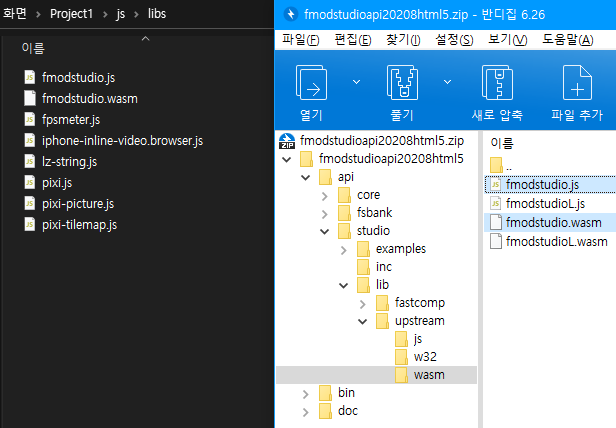

# FMOD_MV.js

<p align="center">
  
</p>

### [Download plugin][releases]

A plugin that helps to use FMOD wasm upstream builds for RPG Maker MV.  
Created by Creta Park (https://creft.me/cretapark)

This plugin's license is a variant of the MIT License,
so you are free to use it as long as you comply with these terms.

Please observe the license terms below :

1. When using this plugin with other software, the software must be
   a game developed and made with RPG Maker, and `FMOD_MV.js by Creta Park`
   must be written in the credit of these game.

2. Should not be confused 1's content with the attribution of FMOD.  
   Mark completely separate from the attribution of the FMOD.

3. Neither this plugin nor any of its individual components,
   in Original or Modified Versions, may be sold by itself.

4. When redistributed after modification, the original author must be indicated.

*This can also be found in the [LICENSE][LICENSE] file.*

---

## Background

This plugin was created for the [2022 1Chicken game jam contest][1map],
a game jam event hosted by [1Map1Chicken RPG Maker contest][1map-twitter] in Korea.

The game we made by participating in this game jam was DOWNFALLEN,
and it was the opportunity to create the corresponding plug-in for this game.

[The entry page can be viewed here][DOWNFALLEN], but this game is in Korean.

> *However, the text has been pulled out to support fan translations, so contributions are always welcome!*

## Demonstration

If you curious what it does, watch this video.

<p align="center">
  <a href="https://youtu.be/YcVaRldGb4c">
    
  </a>
</p>

## Table of content


# [1.](#table-of-content) Basic knowledge requirements

- Knows how to use FMOD Studio.

- Well aware of the [license][fmod-license], [attribution][fmod-attribution]
  and [legal information][fmod-legal] of FMOD.

# [2.](#table-of-content) Limitation

This plug-in was made in a short period of almost a week,
so some RPG Maker features that were not contained from DOWNFALLEN,
the game that used this plug-in or some features of FMOD, are missed for now.  
That's the reason I released this plugin as alpha stage.

Pull request or contribution are always welcome!

Currently, the limitations I have identified are as follows.

- Velocity for doppler effect, etc.  
  The characters in RPG Maker have very consistent movement speeds,
  so when I applied velocity to them, the results were very strange
  so I didn't implement it.

- Streaming RPG Maker's native audio system to FMOD  
  FMOD has a feature that helps to read an external audio buffer
  and output it through the bus, but this has not been
  implemented yet.

- Not fully implemented ME specs  
  I have not yet implemented the specification of ME that plays
  BGM when it is interrupted during BGM playback and ME plays
  and disappears.

- Can't support event callbacks  
  Event callback is a feature that receives this signal from the game
  when a call function is put in an event created in FMOD Studio.  
  It also provides basic functions such as beat per callbacks, etc.  
  
  Anyways, this is a big mistake in my plugin design.
  
  Callbacks can be registered for events in the FMOD, but cannot be unregistered.  
  This is presumably because the FMOD assumes that the event is
  instantiated and used once and then discarded.
  
  FMOD also provides its own object pooling system.
  
  However, I implemented the pooling of the instanced event without knowing this,
  and the above problems resulted in an environment where callbacks could not be used naturally.
  
  Currently, this mistake is the biggest technical debt for this plugin.

- All of the battle related features  
  Since we didn't have to use it while making DOWNFALLEN.

# [3.](#table-of-content) Setup project

## [3.1.](#table-of-content) Add plugin to your project

Put `FMOD_MV.js` in the `plugins` folder, and then add the plugin in your RPG Maker project.  
Plugin's order doesn't matter, unless you're using additional audio-related featured plugins.

## [3.2.](#table-of-content) Add FMOD Engine

  
[Download FMOD Engine at here][fmod-download], it requires HTML5 version.  
Please use version `2.01.13` for now, it's verified by me (works well on DOWNFALLEN).  
[Here's why in this thread][nwjs-problem].

  
Because of we downloaded the `2.01.13` version of engine above, so I recommended to use Studio program with `2.01.13` version too for minimize problems.

  
Put `fmodstudio.js` and `fmodstudio.wasm` in `api/studio/lib/upstream/wasm` of the downloaded zip file into `js/lib` in the project folder.

  
Then open `fmodstudio.js` and find the section
```js
...ENVIRONMENT_IS_NODE=typeof process==="object"&&typeof process...
```
Add `false&&` after `ENVIRONMENT_IS_NODE=` and save it.

Then, open `index.html` in the project folder and add the following line as below into `<body>` tags.

```
<script type="text/javascript" src="js/libs/fmodstudio.js"></script>
```

If you've been working on the index.html you created as a new project, it should look like this :

```diff
 <!DOCTYPE html>
 <html>
     <head>
         <meta charset="UTF-8">
         <meta name="apple-mobile-web-app-capable" content="yes">
         <meta name="apple-mobile-web-app-status-bar-style" content="black-translucent">
         <meta name="viewport" content="user-scalable=no">
         <link rel="icon" href="icon/icon.png" type="image/png">
         <link rel="apple-touch-icon" href="icon/icon.png">
         <link rel="stylesheet" type="text/css" href="fonts/gamefont.css">
         <title>Project1</title>
     </head>
     <body style="background-color: black">
         <script type="text/javascript" src="js/libs/pixi.js"></script>
         <script type="text/javascript" src="js/libs/pixi-tilemap.js"></script>
         <script type="text/javascript" src="js/libs/pixi-picture.js"></script>
         <script type="text/javascript" src="js/libs/fpsmeter.js"></script>
         <script type="text/javascript" src="js/libs/lz-string.js"></script>
         <script type="text/javascript" src="js/libs/iphone-inline-video.browser.js"></script>
+        <script type="text/javascript" src="js/libs/fmodstudio.js"></script>
         <script type="text/javascript" src="js/rpg_core.js"></script>
         <script type="text/javascript" src="js/rpg_managers.js"></script>
         <script type="text/javascript" src="js/rpg_objects.js"></script>
         <script type="text/javascript" src="js/rpg_scenes.js"></script>
         <script type="text/javascript" src="js/rpg_sprites.js"></script>
         <script type="text/javascript" src="js/rpg_windows.js"></script>
         <script type="text/javascript" src="js/plugins.js"></script>
         <script type="text/javascript" src="js/main.js"></script>
     </body>
 </html>
```

Then you are ready to go!

# [5.](#table-of-content) Quick example

To see an quick example in action, create a new RPG Maker project,
and overwrite the `plugins.js` enclosed in the repository with `js/plugins.js` in your newly created project directory.

  
  
And then build the [Celeste FMOD Studio Project][fmod-learning-resources], and setup them by referring to
[Bank asset path](#52-bank-asset-path),
[Bank assets](#53-bank-assets),
and [GUIDs js path](#54-guids-js-path) in this section.

You can check directly at the examples based on this setup in the [Basic Usage](#6-basic-usage) section after this section.

# [5.](#table-of-content) Plugin options

  
This section covers the plugin options menu.

## [5.1.](#table-of-content) Total memory

FMOD's virtual memories' maximum size. (byte units)  
Default setting is `64MB`. (`64 * 1024 * 1024`)

## [5.2.](#table-of-content) Bank asset path

Specify the path where the FMOD's Bank assets are.  
Default setting is `audio/bank`.

  
Bank files created by building in FMOD Studio must all be in the this path.

## [5.3.](#table-of-content) Bank assets

Specify banks to load.  
Master bank and it's strings must be assigned.  
i.e. if you have `Master Bank.bank`, `Master Bank.strings.bank`, `Music.bank` then
you should add `Master Bank`, `Master Bank.strings`, `Music` at this option.

## [5.4.](#table-of-content) GUIDs js path

Specify GUID collection script file.  
Default setting is `audio/bank/fmod_studio_guids.js`.  
From now on, we'll call it **`GUID script`**.


**`GUID script`** file(`fmod_studio_guids.js`) can be generated by the following below process.

1. **Overwrite `exportGUIDsHeader.js` in this repository to your FMOD Studio's scripts file**  
     
   There is a folder called `scripts` in the folder where FMOD Studio is installed, overwrite the script file in it.

2. **Export GUIDs header in FMOD Studio's menu : `Scripts/FMOD Examples/Export GUIDs Header/js File`.**  
     
   Then FMOD Studio will generate **`GUID script`** and save as `fmod_studio_guids.js` in the same location as the project file you are currently working on.  
     
   > Note : If there is an unintentional duplicate of the event name in generated script(`fmod_studio_guids.js`) file, this script will not work due to an error.  
   This possibly can resolved by restarting FMOD Studio, and creating the **`GUID script`** again.

3. **Move the generated script to the path in plugin option.**  
   

That's it!  

## [5.5.](#table-of-content) Integrated VCAs

Specify which VCA is used for each types of channels.  
If you leave these blank, FMOD_MV.js will try finds a VCA name
with `BGM`, `BGS`, `ME`, `SE`, if found them then
it will be used automatically.

Applicable VCA names can be found in `VCA` of **`GUID script`** created in [GUIDs js path][guids-js].

## [5.6.](#table-of-content) System musics

Replaces system music with FMOD events.  
Each item corresponds to the corresponding system music.  
If you leave it blank, it will be played as the music set by RPG Maker. (RM Audio based)

![guid-events-location][guid-events-location]

Applicable event names can be found in `Event` of **`GUID script`** created in [GUIDs js path section][guids-js].

> Note : Battle-related system audio assignments are available for future use.  
> Battle-related parts are not implemented yet, so unintended behavior may occur.

## [5.7.](#table-of-content) System music effects

Replaces system music effect(ME) with FMOD events.  
Each item corresponds to the corresponding system music effects.  
If you leave it blank, it will be played as the music effect set by RPG Maker. (RM Audio based)

![guid-events-location][guid-events-location]

Applicable event names can be found in `Event` of **`GUID script`** created in [GUIDs js path section][guids-js].

> Note : Battle-related system audio assignments are available for future use.  
> Battle-related parts are not implemented yet, so unintended behavior may occur.

## [5.8.](#table-of-content) System sound effects

Replaces system sound effect(SE) with FMOD events.  
Each item corresponds to the corresponding system sound effects.  
If you leave it blank, it will be played as the sound effect set by RPG Maker. (RM Audio based)

![guid-events-location][guid-events-location]

Applicable event names can be found in `Event` of **`GUID script`** created in [GUIDs js path section][guids-js].

## [6.](#table-of-content) Basic usage

FMOD_MV.js is designed in a way to maintain as much unity as possible with RPG Maker.  
However, it has not yet been implemented to harmonize with all functions of RPG Maker.  
(Refer to [2. Limitation](#2-limitation) for details)

The example code in this section can be tried directly in [Quick example](#5-quick-example) if you have created a project set up as instructed in that project!

All guides presented here are based on **script event**.

### [6.1.](#table-of-content) How Events work in FMOD_MV.js

By default, in FMOD, all sounds is Event, but here you can decide which category to play the Event you want to play in: `BGM`, `BGS`, `ME`, `SE`.  
As mentioned earlier, this is because the focus is on unifying the functional elements with RPG Maker.  
Such as assigning the Event played in the `BGM` and `BGS` categories in the save and replaying them when they are recalled.


And in FMOD_MV.js, the concept is implemented that called Speaker, in all character elements (e.g. events on the map, player characters, party members, vehicles, etc.).

Speakers work so that sound is attached to a specific object.  
If the FMOD Event is 3D, stereo sound can be used, and for this purpose, Speaker is used.

So keep this in mind.

https://github.com/creta5164/fmod-rmmv/blob/initial-work/img/explain-rmmv-space-n-fmod-space.mp4

If there is a sound, then there must be a listener to hear the sound.  
Basically, the listener is a structure facing the front from the back `10 units` from the position (depth) where the characters are as shown in the figure.

### [6.1.](#table-of-content) Playing event

#### [6.1.1.](#table-of-content) Play BGM

```js
FMOD_MV.PlayBGM(guid, isAppend, immediateStop);
```

Plays Event as BGM category.

- `guid` : The Event you want to play in the BGM category.  
  You can use the event defined in **`GUID script`**.  
  If you're not sure what to put in, check out the example below.

- `isAppend` : (Optional) Determines whether to play a new BGM event while leaving the playing BGM as it is.  
  Acceptable value is `true` for yes, `false` for no, and default is `false`.

- `immediateStop` : (Optional) Determines how the FMOD stops previously playing music.  
  Acceptable value is `true` for yes, `false` for no, and default is `false`.

**Example**

1. Play `music_lvl1_main` Event with slowly stopping the previous BGM Events  
   ```js
   FMOD_MV.PlayBGM(FMOD_FSPRO.Event.music_lvl1_main);
   ```

2. Overlaying `music_lvl1_theo` Event  
   ```js
   FMOD_MV.PlayBGM(FMOD_FSPRO.Event.music_lvl1_theo, true);
   ```

3. Immediately stop the BGM Events being played and play `music_lvl2_chase` Event.  
   ```js
   FMOD_MV.PlayBGM(FMOD_FSPRO.Event.music_lvl2_chase, false, true);
   ```

#### [6.1.2.](#table-of-content) Play BGS

```js
FMOD_MV.PlayBGS(guid, isAppend, immediateStop);
```

Plays Event as BGS category.

- `guid` : The Event you want to play in the BGS category.  
  You can use the event defined in **`GUID script`**.  
  If you're not sure what to put in, check out the example below.

- `isAppend` : (Optional) Determines whether to play a new BGS event while leaving the playing BGS as it is.  
  Acceptable value is `true` for yes, `false` for no, and default is `false`.

- `immediateStop` : (Optional) Determines how the FMOD stops previously playing music.  
  Acceptable value is `true` for yes, `false` for no, and default is `false`.

**Example**

This is similar to [Play BGM](#611-play-bgm), check out the [Play BGM](#611-play-bgm)'s example.

#### [6.1.3.](#table-of-content) Play ME

```js
FMOD_MV.PlayME(guid, immediateStop);
```

Plays Event as ME category.  
As with RPG Maker, when an event in the ME category is triggered, the BGM remembers the state and goes into a stopped state.  
When all MEs are finished or stopped, the BGM recalls what it remembered and plays it again.

> Note : FMOD Events played in this category will not be recorded in save file.

- `guid` : The Event you want to play in the ME category.  
  You can use the event defined in **`GUID script`**.  
  If you're not sure what to put in, check out the example below.

- `immediateStop` : (Optional) Determines how the FMOD stops previously playing music.  
  Acceptable value is `true` for yes, `false` for no, and default is `false`.

**Example**

1. Play `ui_postgame_strawberry_total_all` Event with slowly stopping the previous ME Events  
   ```js
   FMOD_MV.PlayME(FMOD_FSPRO.Event.ui_postgame_strawberry_total_all);
   ```

2. Play `ui_postgame_strawberry_total_all` while immediately stopping the previous ME Events  
   ```js
   FMOD_MV.PlayME(FMOD_FSPRO.Event.ui_postgame_strawberry_total_all, true);
   ```

### [6.1.4.](#table-of-content) Play SE

```js
FMOD_MV.PlaySE(guid, at, parameters, forceBind);
```

Plays Event as SE category.  
It has the most functions, please read carefully and check it with examples.

> Note : FMOD Events played in this category will not be recorded in save file.

- `guid` : The Event you want to play in the SE category.  
  You can use the event defined in **`GUID script`**.  
  If you're not sure what to put in, check out the example below.

- `at` : (Optional) Specifies where the sound is coming from.  
  Acceptable values are below, default is `null`(none).
  
  - `this` is for RPG Maker event itself that executing this script.  
    There's also have explicit expression as `this.event()`.  
    If the FMOD Event is 3D or `forceBind` is `true`, it will be bound to this character's Speaker.
  
  - `$gamePlayer` is for player character.  
    If the FMOD Event is 3D or `forceBind` is `true`, it will be bound to player character's Speaker.
  
  - `$gameMap.event(<ID>)` is for RPG Maker event in current map by ID.  
    In example, if you want make sound to RPG Maker event with ID 12 then use `$gameMap.event(12)`.  
    If the FMOD Event is 3D or `forceBind` is `true`, it will be bound to target RPG Maker event character's Speaker.
  
  - `{x:<X>,y:<Y>}` is for only specifying sound's location.  
    In example, if you want make sound to event on `X:51`, `Y:64` then use `{x:51,y:64}`.  
    You can also use this to mix multiple expressions like `{x:51,y:$gamePlayer.y}`, `{x:$gameMap.event(24).x,y:this.event().y}`...

- `parameters` : (Optional) Specifies the Event parameters before start Event.  
  It is designed to allow multiple parameters to be specified.  
  It follows the syntax below.  
  ```json
  {
    "<Parameter Name 1>": [<Value>, <Immediate Set>],
    "<Parameter Name 2>": [<Value>, <Immediate Set>],
    "<Parameter Name 3>": [<Value>, <Immediate Set>]
  }
  ```
  - `Parameter Name` : Specifies parameter name for Event.
  
  - `Value` : The value to assign to the corresponding parameter.  
    FMOD Studio allows you to specify different formats for parameters, but these formats are all numeric as a result.
  
  - `Immediate Set` : Specifies that this parameter will be assigned directly.  
    Acceptable value is `true` for yes, `false` for no.
  
  For detailed usage examples, please refer to the **Example** below.

- `forceBind` : (Optional) Whether to force bind to the `at`.  
  So if `at` is `null` or `{x:<X>,y:<Y>}` then don't need to use it.  
  Acceptable value is `true` for yes, `false` for no, and default is `false`.

**Example**


[releases]: https://github.com/creta5164/fmod-rmmv/releases
[LICENSE]: https://github.com/creta5164/fmod-rmmv/blob/main/LICENSE
[1map]: https://1map1chicken.com/entries/jam2022
[1map-twitter]: https://twitter.com/1map1chicken
[DOWNFALLEN]: https://1map1chicken.com/entries/jam2022/downfallen-다운폴른
[fmod-license]: https://www.fmod.com/licensing
[fmod-attribution]: https://www.fmod.com/attribution
[fmod-legal]: https://www.fmod.com/legal
[fmod-download]: https://www.fmod.com/download#fmodengine
[fmod-learning-resources]: https://www.fmod.com/download#learningresources
[nwjs-problem]: https://qa.fmod.com/t/problem-with-html5-build-on-nw-js/19116
[guids-js]: #44-guids-js-path
[guid-events-location]: ./img/guid-events-location.png